# VenomPremium
Documentation for Venom Premium Plugins for VCV Rack

# Venom Oscillations plugin
Venom Oscillations [version 2.0.0](VenomOscillationsChangeLog.md) for VCV Rack 2 is copyright 2025 Dave Benham and licensed under the [VCV Rack End User License Agreement](LICENSE.md).

Thank you for your interest in and/or purchase of the Venom Oscillations plugin for VCV Rack 2. This plugin is intended to be a set of complex oscillator modules that produce interesting sounds that are difficult to create otherwise.

Currently there is only one module, Sofia's Daughter.

I have tentative plans for at least one more complex oscillator. If/when a new oscillator is added, the plugin purchase price will likely increase in $5 increments. However, existing plugin owners will receive the new module for free.

If you are on the fence of purchasing, you can try out a [Sofia's Daughter prototype/emulation patch](https://patchstorage.com/orb_sq-and-venom-sophia/) created using only free modules. You can experiment with some of the types of sounds Sofia's Daughter can produce. If you like it, then you can be confident Venom Oscillations sounds at least as good, has greater tonal range, is more CPU efficient, and is much more convenient to patch than the emulation/prototype patch.

# Sofia's Daughter
*Quick Links: [Intro](#sofias-daughter) | [Fundamental](#fundamental-section) | [Ripples](#ripple-sections) | [Global](#global-section) | [Output](#output-section) | [ContextMenus](#context-menus) | [XAOS-Venom Differences](#differences-from-xaoc-devices-sofia)*

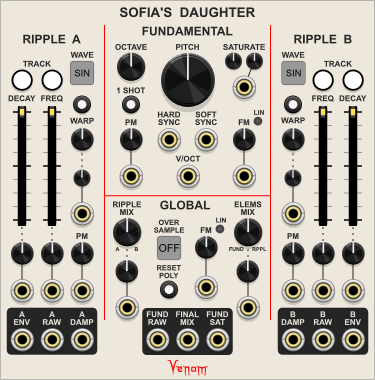  
Sofia's Daughter is a complex polyphonic formant oscillator inspired by the wonderful [XAOC Devices Sofia "1955 Transcendent Analog Waveform Oscillator"](http://xaocdevices.com/main/sofia). Sofia's Daughter implements all the basic functionality (though not necessarily the exact sound) of the XAOC Eurorack hardware module, and then extends the functionality with additional controls, inputs, and outputs. A [complete list of known differences](#differences-from-xaoc-devices-sofia) is listed at the end of this documentation.

The underlying principle behind the module is FOF (fonction d'onde formantique) synthesis, a method of producing formant sounds through short bursts of decaying sinusoidal waveforms. The primary output of Sofia's Daughter consists of two such decaying sinusoidal waveforms, called Ripple elements, combined with a saturated sine wave called the Fundamental. Sofia's Daughter extends the FOF synthesis by allowing waveforms other than sine for the Ripple elements.

The Fundamental wave hard syncs the Ripple elements and also triggers their decay envelopes upon the start of each Fundamental cycle. The Ripple frequencies are measured as ratios of the Fundamenal frequency, and the Ripple decay length is proportional to the Fundamental wavelength. Because the Ripple elements are always phase aligned with the Fundamental, the output can remain harmonious, regardless what frequency ratios are used for the Ripples.

Here is one example of an output waveform, along with the three component elements.

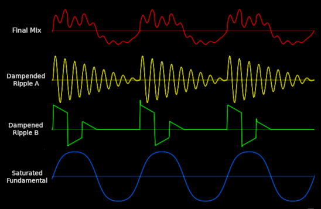  

With these three basic building blocks, plus a bunch of modulation possibilities, Sofia's Daughter can produce an astonishing range of sounds. Of course the output works well with VCAs and Filters, but rich resonant sounds can be produced without a filter. And the Ripple decay envelopes coupled with available one shot modes allow for the creation of percussive and bell-like voices without the need of external VCAs or envelope generators.

All inputs can be driven at audio rates. Oversampling is available to mitigate digital aliasing that might otherwise be present at the outputs.

Because all inputs and outputs are polyphonic, a single instance of Sofia's Daughter can create up to 16 independent voices. The total number of channels at each output port is the maximum number of channels found across all inputs. If an input is monophonic, than the single channel is replicated to match the output channel count. If a polyphonic input has fewer channels than the outputs, then missing channels are treated as constant 0V.

Polyphony also makes it possible to work with more than two Ripple elements for a single voice by applying polyphonic CV to Ripple inputs only, and using only monophonic CV for the Fundamental. There will still be multiple Fundamental waves, but they all will be running at the same rate with the same saturation. If the Fundamentals are out of phase, then simply patch a mono trigger to the Hard Sync input. The sync trigger can be removed once the Fundamentals are in phase.

Be sure to watch [Omri Cohen's overview of Sofia's Daughter](https://www.youtube.com/watch?v=yUtYXnmDmvg) that provides many ideas on techniques to explore. You might also check out video's about the XAOC Devices Sofia from [Tom Churchill](https://youtu.be/5lWf4N7jbbI) and [Monotrail Tech Talk](https://youtu.be/xdjGRF7Wtwg), as they may also provide inspiration for ways you might use Sofia's Daughter in your VCV patches.

*Quick Links: [Intro](#sofias-daughter) | [Fundamental](#fundamental-section) | [Ripples](#ripple-sections) | [Global](#global-section) | [Output](#output-section) | [ContextMenus](#context-menus) | [XAOS-Venom Differences](#differences-from-xaoc-devices-sofia)*

## Sofia's Daughter Layout
Sofia's Daughter can be divided into 5 distinct sections, each with its own purpose
- **[Fundamental](#fundamental-section)** ***(top center)***: Controls the frequency, shape, and timing of the fundamental sine wave
- **[Ripple A](#ripple-sections)** ***(left)***: Controls the frequency, decay, and shape of the first ripple element
- **[Ripple B](#ripple-sections)** ***(right)***: Controls the frequency, decay, and shape of the second ripple element
- **[Global](#global-section)** ***(mid center)***: Controls the mix of the three elements, plus additional controls that affect all three elements
- **[Outputs](#output-section)** ***(bottom)***: Nine different outputs are available

There are also [context menu options](#context-menus) that give access to some additional minor functionality.

## Fundamental Section
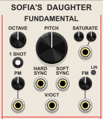  
The Fundamental sine wave has six basic types of control
- Frequency
- Mode
- Saturation
- Frequency Modulation
- Phase Modulation
- Sync

### Fundamental Frequency
The **OCTAVE** knob establishes the range of the Pitch knob. The Octave ranges from -2 to 6, with each integral value representing a particular octave for the note C. The default noon value is C2.

The **PITCH** knob applies an offset to the value established by the Octave knob. The offset is measured in cents, with 100&cent; representing one semitone. The range is -1200&cent; to 1200&cent; (+/- 1 octave), with zero offset at the default noon position.

The bipolar **V/OCT** CV input further offsets the fundamental frequency. Each volt represents one octave offset.

### Fundamental Mode

The **1 SHOT** button controls the mode of the Fundamental oscillator. It has three states.
- **Off** ***(gray, default)***: The fundamental oscillates continuously
- **Retriggered one shot** ***(yellow)***: The fundamental produces one single wave cycle upon receiving a trigger at the Hard Sync input, then stops and waits for the next trigger. The oscillator can be retriggered to start afresh mid-cycle.
- **Triggered one shot** ***(blue)***: Same as Retriggered one shot, except triggers received mid-cycle are ignored.

Remember that the Fundamental triggers the Ripple envelopes every cycle. So if using a one shot mode, each time the Fundamental is triggered, it also triggers the Ripple envelopes. Upon envelope completion, the Ripple envelope will wait for the next trigger, just like the Fundamental.

### Fundamental Saturation

The left small knob below the **SATURATE** label controls the base amount of saturation to apply to the sine wave. Fully counter-clockwise applies no saturation, and fully clockwise applies the maximum amount of saturation allowed. The default at noon is 50% of the maximum.

The degree of saturation can be additively modulated by the associated bipolar CV input with its small attenuverter knob. One volt of CV at 100% represents 10% saturation.

The net sum of base saturation plus attenuated CV is clamped to a value between 0% and 100%.

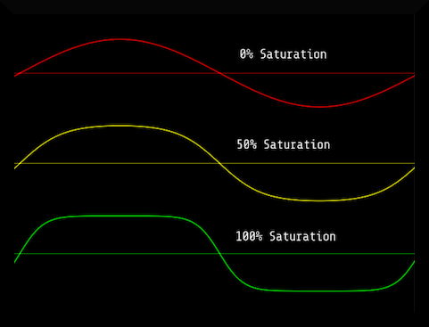

### Fundamental Frequency Modulation

Frequency modulation can be applied to the Fundamental wave via the **FM** CV input, with its own dedicated attenuator.

There are three FM modes controlled by the small associated **LIN** (linear) button.
- **Off** ***(gray, default)***: Exponential FM is used. The CV is DC coupled.
- **AC coupled** ***(yellow)***: Through zero linear FM is used. The CV is AC coupled so that CV with DC bias can still produce harmonious results. A high pass filter removes DC bias from the CV.
- **DC coupled** ***(blue)***: Through zero linear FM is used, but this time the CV is DC coupled, preserving any DC bias.

Note that Fundamental FM never applies to the Ripple frequency or decay length computations. However, FM can cause folding of the fundamental wave such that it changes the rate at which the Ripple elements are triggered.

### Fundamental Phase Modulation

Phase modulation can be applied to the Fundamental wave via the **PM** CV input, with its own dedicated attenuator. Phase modulation is often incorrectly referred to as through zero linear FM, and with sinusoidal CV it can give the same results. But other waveforms produce different results than true linear FM.

Phase modulation can cause folding of the fundamental wave. But unlike the frequency modulation, phase modulation never alters the rate at which the Ripple elements are triggered.

### Fundamental Sync

The **HARD SYNC** CV input resets the fundamental wave to phase 0 upon receipt of a trigger. It is also used to trigger the Fundamental when using a one shot mode.

The **SOFT SYNC** CV input reverses the direction of the fundamental wave upon receipt of a trigger.

Both sync inputs use Schmitt triggers that are triggered at 2V and reset at 0.2V so they can be used with both unipolar and bipolar inputs.

*Quick Links: [Intro](#sofias-daughter) | [Fundamental](#fundamental-section) | [Ripples](#ripple-sections) | [Global](#global-section) | [Output](#output-section) | [ContextMenus](#context-menus) | [XAOS-Venom Differences](#differences-from-xaoc-devices-sofia)*

## Ripple Sections
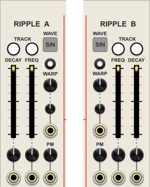  

The Ripple A and Ripple B sections behave identically, other than being mirror images of each other.

Each Ripple has five main types of control:
- Waveform
- Envelope decay length
- Ripple frequency
- Warp modulation that has different effects, depending on the mode
- Phase modulation

### Ripple Waveform

The square **WAVE** button sets the basic waveform of the Ripple element. It has three possible values:
- **SIN** ***(default)*** - Sine
- **TRI** - Triangle
- **SQR** - Square

### Ripple Envelope Decay
The Ripple decay envelope controls how each Ripple envelope is damped. It always has an instantaneous attack, and the decay length is always measured as a ratio of the Fundamental wavelength.

The **DECAY TRACK** button controls whether the decay length tracks CV at the Fundamental V/Oct input. If off, then only the Fundamental Octave and Pitch knobs affect the decay length. If on, then the V/Oct CV is added to the computation.

The **DECAY** slider sets the ratio of the envelope decay length to the Fundamental wavelength. It ranges from 0.015625 (1/64) to 16 times the Fundamental wavelength.

The associated bipolar Decay CV input and attenuverter knob can additively modulate the decay length beyond the limits of the slider. Both the slider and the CV respond exponentially.

Note that envelopes with a ratio >1 normally never reach the end because the start of the next Fundamental cycle retriggers the Ripple envelopes. So the maximum decay ratio of 16 results in minimal damping of the Ripple element.

But if using a Fundamental one shot mode, the Ripple envelopes are triggered the same time as the Fundamental, and the envelopes always decay to completion unless another trigger is received. Upon completion, each envelope waits for the next Fundamental trigger.

### Ripple Frequency
The Ripple frequency is always measured as a ratio of the Fundamental frequency.

The **FREQ TRACK** button controls whether the ripple frequency tracks CV at the Fundamental V/Oct input. If off, then only the Fundamental Octave and Pitch knobs affect the frequency (as well as any Global FM). If on, then the V/Oct CV is added to the computation.

The **FREQ** slider sets the ratio of the Ripple frequency to the Fundamental frequency. It ranges from 1 to 256 times the Fundamental frequency.

The associated bipolar Frequency CV input and attenuverter knob can additively modulate the frequency ratio. Both the slider and CV respond exponentially. CV can modulate the frequency ratio above 256, but the minimum effective frequency ratio is 1.

### Ripple Warp Modulation
The small button above the **WARP** label controls the mode of the Warp modulation. There are a total of nine modes. In general, the Warp can either influence the Ripple frequency, the envelope decay curve, or the Ripple waveform shape. The button is color coded.

**Frequency ramp modulation available to all waveforms**
- **Frequency ramp** ***(white, default)***: The warp value specifies a ratio of the base frequency that each ripple starts at, and then modulates to the base frequency by the end of the envelope decay. This is the warp effect implemented by the XAOC Sofia hardware.
- **Inverse frequency ramp** ***(yellow)***: The ripple starts at the base frequency, and the frequency modulates to the warp ratio value by the end of the envelope decay.

The warp ratio value ranges from 0.25 (1/4) to 4 times the base frequency.

**Envelope decay curve modulation available to all waveforms**
- **Envelope J-curve** ***(brown or dark red)***
- **Envelope S-curve** ***(tan)***

The warp value ranges from an arbitrary -100% to 100%.

**Ripple shape modulation available to all waveforms**
- **Ripple PWM** ***(red)***: Pulse width modulation

The warp value ranges from 10% to 90%. For sine and triangle waveforms the percentage represents the width of the positive portion of the waveform. The negative portion is shrunk or expanded to total 100%.

**Ripple shape modulation available only to sine and triangle**  
The same colors are available to square, but they simply repeat the first four modes.
- **Ripple skew** ***(orange)***
- **Ripple J-curve** ***(dark blue)***
- **Ripple S-curve** ***(light blue)***
- **Ripple rectify** ***(green)***

The warp value ranges from an arbitrary -100% to 100%

The **WARP** knob sets the base Warp value. The associated bipolar CV input and small attenuverter can additively modulate the Warp value. The sum of the knob plus attenuated CV is clamped to the range for the current mode. With the Warp knob at the default noon position, and no CV, there is no Warp effect.

The traces below demonstrate the different Warp effects that are available. CCW represents full counter-clockwise Warp, and CW represents full clockwise Warp. Each trace uses a decay ratio of 1 and a frequency ratio of 15.

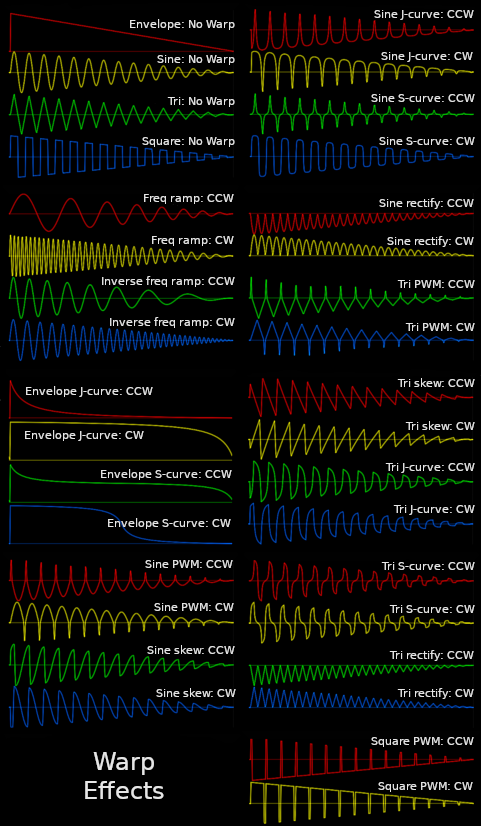

### Ripple Phase Modulation

Phase modulation can be applied to the Ripple wave via the **PM** CV input, with its own dedicated attenuator.

*Quick Links: [Intro](#sofias-daughter) | [Fundamental](#fundamental-section) | [Ripples](#ripple-sections) | [Global](#global-section) | [Output](#output-section) | [ContextMenus](#context-menus) | [XAOS-Venom Differences](#differences-from-xaoc-devices-sofia)*

## Global Section
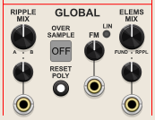  
The Global section controls the following:
- Overall mix of the main output
- Frequency Modulation applied to the Fundamental and both Ripple elements
- Oversampling to mitigate digital aliasing
- Polyphony Reset to deal with unwanted polyphonic feedback

### Overall Mix Control

Two different controls are used to create the main Final Mix output

The **RIPPLE MIX** knob controls the mix of Ripple A and Ripple B, with full counter-clockwise selecting 100% A, and full clockwise representing 100% B. The default noon value is a 50/50 mix of both. The knob is scaled to represent the percentage of Ripple B. The Ripple A percentage is simply 100% minus the Ripple B percentage. 

The Ripple Mix can be modulated via the associated bipolar CV input and attenuverter. Each volt of CV equates to 10% Ripple B. The attenuated CV value is summed with the knob value to get the effective Ripple Mix. The effective value is clamped to between 0 and 100% Ripple B.

The **ELEMS MIX** knob controls the mix of the Fundamental saturated sine wave relative to the Ripple elements from the Ripple Mix. Full counter-clockwise is 100% Fundamental, and full clockwise is 100% Ripple Mix. The default noon value is a 50/50 mix of both. The knob is scaled to represent the percentage of Ripple Mix. The Fundamental percentage is simply 100% minus the Ripple Mix percentage.

The Elements mix can be modulated via the associated bipolar CV input and attenuverter. Each volt of CV equates to 10% Ripple Mix. The attenuated CV value is summed with the knob value to get the effective Elements Mix. The effective value is clamped to between 0 and 100% Ripple Mix.

### Global Frequency Modulation
The **FM** CV input and attenuator provides for simultaneous frequency modulation of the Fundamental sine and both Ripple elements.

There are three FM modes controlled by the small associated **LIN** button.
- **Off** ***(gray, default)***: Exponential FM is used. The CV is DC coupled.
- **AC coupled** ***(yellow)***: Through zero linear FM is used. The CV is AC coupled so that CV with DC bias can still produce harmonious results. A high pass filter removes DC bias from the CV.
- **DC coupled** ***(blue)***: Through zero linear FM is used, but this time the CV is DC coupled, preserving any DC bias.

Even though the Global FM modulates the Ripple element frequencies, it does not modulate the Ripple decay times. However, since global FM can fold the Fundamental sine, it can alter the rate at which the Ripple envelopes are triggered.

### Oversampling
DPW antialiasing is applied to Ripple square waves, and simple sine and triangle waves rarely have significant aliasing. So in the absence of any CV modulation, oversampling is rarely needed. But if audio rate CV modulation is applied, then unwanted digital aliasing can arise.

The square **OVER SAMPLE** button controls oversampling that is used to mitigate digital aliasing. It has 6 values:
- **Off** ***(default)***
- **x2**
- **x4**
- **x8**
- **x16**
- **x32**

When oversampling is activated, every CV input is upsampled with interpolation to the oversample rate times the VCV sample rate. All internal processing is done at this elevated rate. At each output, a low pass filter removes high frequency content that would alias at the original VCV sample rate, and then the signal is downsampled back to the VCV sample rate.

Each input that is upsampled with interpolation consumes a significant amount of CPU power, as does the low pass filter for each output. So if your system has limited CPU power, it may be wise to avoid oversampling unless unwanted aliasing is detected in the output. And if oversampling is used, the lowest value should be used that provides acceptable results.

### Polyphony Reset

Once polyphony is introduced at any one of the CV inputs, all outputs become polyphonic. If there is a feedback loop from one of the outputs to one of the inputs, then all output will remain polyphonic even after all external polyphonic CV sources are removed. In this case all poly channels will produce the same signal, except for possible phase differences.

The **RESET POLY** button can be used to temporarily force all outputs to monophonic so that upon release, the outputs will revert back to the maximum number of channels found across all external CV inputs.

*Quick Links: [Intro](#sofias-daughter) | [Fundamental](#fundamental-section) | [Ripples](#ripple-sections) | [Global](#global-section) | [Output](#output-section) | [ContextMenus](#context-menus) | [XAOS-Venom Differences](#differences-from-xaoc-devices-sofia)*

## Output Section
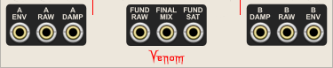  

There are nine outputs available across the bottom of the module.

- **A ENV** - the unipolar decay envelope for Ripple A
- **A RAW** - the constant bipolar Ripple A signal without any damping from the decay envelope
- **A DAMP** - the bipolar damped Ripple A signal after the A decay envelope has been applied
- **RAW FUND** - the bipolar Fundamental sine signal without any saturation
- **FINAL MIX** - the bipolar mix of saturated Fundamental sine and both damped Ripple elements
- **SAT FUND** - the bipolar Fundamental sine signal with saturation applied
- **B DAMP** - the bipolar damped Ripple B signal after the B decay envelope has been applied
- **B RAW** - the constant bipolar Ripple B signal without any damping from the decay envelope
- **B ENV** - the unipolar decay envelope for Ripple B

Any of the outputs can be used as an audio source, or as a modulator. Many interesting sounds can be found by patching an output into one of Sofia's Daughter CV inputs, thus creating a feedback loop.

### Bypass Behavior

All outputs are constant monophonic 0V if Sofia's Daughter is bypassed.

*Quick Links: [Intro](#sofias-daughter) | [Fundamental](#fundamental-section) | [Ripples](#ripple-sections) | [Global](#global-section) | [Output](#output-section) | [ContextMenus](#context-menus)*

## Context Menus

### Custom Port and Parameter Names
Every port (input or output), and every parameter (knob, slider, or button) has its own context menu option to set a custom name. Custom names only appear in context menus and hover text - they do not change the faceplate graphics.

If a parameter or port is given a custom name, then an additional option is added to restore the factory default name.

Custom names are saved with the patch and with presets, and restored upon patch or preset load. Custom names are also preserved when duplicating a module.

### Parameter Locks and Custom Defaults
Every parameter (knob, slider, or button) has its own parameter context menu options to lock the paramenter as well as set a custom default value. In addition, there are module context menu options to lock and unlock all parameters.

Parameter lock and custom default settings are saved with the patch and with presets, and restored upon patch or preset load. Parameter lock and custom default settings are also preserved when duplicating a module.

**Parameter Locks**  
The parameter tooltip includes the word "locked" below the parameter name when hovering over a locked parameter.

The parameter value cannot be changed by any means while the parameter is locked. All of the normal means of changing a parameter value are blocked:

- The parameter cannot be dragged or pushed
- Context menu value keyins are ignored
- Double click and context menu initialization are ignored
- Randomization requests are ignored

**Custom Defaults**  
A custom default value overrides the factory default whenever a parameter is initialized. An additional parameter menu option is added to restore the factory default whenever a custom default is in effect.

### Themes
The module context menu includes options to set the default theme and default dark theme for the VenomOscillations plugin, as well as a theme override for each module instance.

There are 4 themes to choose from.

- Ivory (high contrast with off-white background)
- Coal (high contrast with blackish background)
- Earth (low contrast with a brown background)
- Danger (high contrast with vibrant red background)

If a module instance is set to use a specific theme, then that theme will be used regardless whether VCV Rack is set to use dark panels or not. If a module is set to use the default theme, then the VCV Rack "Use dark panels if available" setting controls which default is used. If not enabled, then the default theme is used. If enabled then the default dark theme is used.

If you want the default theme to disregard the VCV Rack dark panel setting, then simply set both defaults to the same theme.

The factory default theme is ivory, and the factory default dark theme is coal.

*Quick Links: [Intro](#sofias-daughter) | [Fundamental](#fundamental-section) | [Ripples](#ripple-sections) | [Global](#global-section) | [Output](#output-section) | [ContextMenus](#context-menus) | [XAOS-Venom Differences](#differences-from-xaoc-devices-sofia)*

## Differences from XAOC Devices Sofia

Here is a summary of the major known differences between XAOC Devices Sofia and Venom Sofia's Daughter.

### Inconsequential name changes (Sofia name -> Sofia's Daughter name)

**Controls and CV**
- Global FM -> Fundamental FM
- Pitch FM -> Global FM
- Elements Mix -> Ripple Mix
- Fund-Elem Mix -> Elems Mix
- Damp A / B -> A / B Decay (Decay time ratio)
- Ratio A / B -> A / B Freq (Frequency ratio)

**Outputs**
- Impulse A / B -> A / B Env (envelope)
- A / B Out -> A / B Raw

### Main disadvantage of Sofia's Daughter
-  The digital implementation limits frequency, and can also lead to aliasing. But oversampling options are available to mitigate aliasing

### Global Sofia's Daughter Enhancements
- Polyphony! All inputs and outputs are polyphonic
- Added attenuators or attenuverters for all CV inputs (except for V/Oct and sync inputs)
- Options for global linear through zero FM in addition to exponential FM (actually called pitched FM on Sofia)

### Fundamental Sine VCO enhancements
- User control of sine saturation level, including CV input
- Hard Sync
- Soft Sync
- One shot modes triggered by Hard Sync - great for percussion voices
- Phase Modulation (frequently called through-zero linear frequency modulation)
- Options for fundamental linear through zero FM in addition to exponential FM (actually called global FM on Sofia)

### Ripple Element VCO enhancements
- Additional triangle option to go along with sine and square
- Phase Modulation
- Multiple Warp modes available to all wave forms
  - Frequency ramp (the default mode that matches the XAOC hardware)
  - Inverse frequency ramp
  - J curve envelope decay shape
  - S curve envelope decay shape
  - Ripple PWM (even for sine and triangle!)
- Additional Ripple shaping Warp modes available to sine and triangle only
  - Ripple skew
  - Ripple J-curve
  - Ripple S-curve
  - Ripple rectify

### Additional Outputs
- Saturated fundamental sine
- Damped Ripple A
- Damped Ripple B

*Quick Links: [Intro](#sofias-daughter) | [Fundamental](#fundamental-section) | [Ripples](#ripple-sections) | [Global](#global-section) | [Output](#output-section) | [ContextMenus](#context-menus) | [XAOS-Venom Differences](#differences-from-xaoc-devices-sofia)*

# Spice Factory
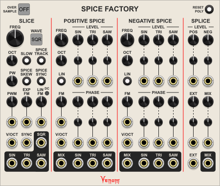  

Spice Factory is a polyphonic complex wave splicing triple oscillator heavily inspired by the [Future Sound Systems OSC2 Recombination engine](https://www.futuresoundsystems.co.uk/returnosc2.html). Spice Factory attempts to replicate the features of the FSS OSC2, and then adds many [additional features](#known-differences-from-the-fss-osc2).

The two primary unipolar sound sources are Positive Spice (0 to 5 volts), and Negative Spice (-5 to 0 volts). A third bipolar Slice oscillator is used as an amplitude modulator to cut the Spice waveforms into pieces. The Positive Spice is preserved during the positive portion of the Slice, and the Negative Spice is preserved during the negative portion of the Slice. The modulated Spice pieces are then merged into a cohesive complex bipolar waveform by the Splice mixer. This briefly describes the wave splicing capabilities of Spice Factory. But there are many controls and CV inputs to perform all manner of modulation throughout the entire process:
 - Pulse width modulation
 - Exponential frequency modulation
 - Linear through-zero frequency modulation
 - Spice frequency skewing that is controlled by the Slice pulse width
 - Hard sync (phase reset)
 - Phase modulation
 - An external input that can be mixed with the spliced waveform
 - Many VCAs for mixing and amplitude modulation

All inputs can be modulated at audio rates. The module can also be put into an LFO mode for creation of interesting low frequency modulation shapes.

There are a total of thirteen outputs available for use as audio or CV throughout your patch, providing many opportunities for feedback modulation.

Since Spice Factory emulates the FSS OSC2 feature set as a starting point, the techniques demonstrated in the [DivKid video on the FSS OSC2](https://www.youtube.com/watch?v=Vy23uZSsdLY) can be applied to Spice Factory as well. Just remember that many of the OSC2 concepts have been renamed in Spice Factory. Of course many more techniques are available with the additional controls unique to the Spice Factory.

### Anti-aliasing and the OVER SAMPLE button
Spice Factory is a purely digital implementation with many non-linear processes that can lead to high frequency outputs. High frequency content that is above the Nyquist frequency (1/2 the VCV sample rate) is reflected down and perceived as inharmonic audio aliasing. The aliasing is usually not desired, so Spice Factory offers oversampling options to mitigate aliasing.

The square OverSample button in the upper left corner provides the following options
- Off
- 2x
- 4x
- 8x
- 16x
- 32x

Inputs are upsampled to the oversample rate using interpolation. All computations are performed at the higher overample rate. At the end a low pass filter is used to remove high frequency content that would otherwise be aliased, and then the result is downsampled back to the VCV sample rate at the outputs. Note that oversampling cannot remove aliasing that already exists within inputs.

Oversampling is computationally expensive, so it is best to use the lowest level of oversampling that provides acceptable results. Typically 4x or 8x provide good audio results when the VCV sample rate is 44 or 48 kHz, but lower levels may be acceptable. Oversampling is not needed for low frequency outputs.

### Polyphony and the RESET POLY button
Spice Factory is fully polyphonic. The number of channels for all outputs is determined by the maximum channel count found across all inputs. Monophonic inputs are replicated to match the output channel count. Polyphonic inputs with fewer channels assume constant 0 volts for the missing channels.

If you have a Spice Factory patch that uses feedback, then when you remove the external polyphonic input, the outputs will continue to be polyphonic due to the feedback. In this case you can press the Reset Poly button to temporarily force all outputs to be monophonic. When you release the button the feedback will still be monophonic, so the outputs will remain monophonic.

## SLICE oscillator section
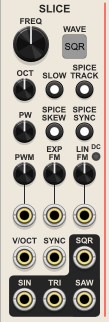  

The Slice oscillator produces 4 different waveforms simultaneously: Sine, Triangle, Square (pulse), and Saw (descending ramp). All four waveforms are available as independent outputs to be used however you see fit. But the primary purpose of this oscillator is to slice (switch on and off via amplitude modulation) the Spice oscillators.

### WAVE square button
This button selects which waveform is used to slice the Spice waveforms.

### FREQ (frequency) knob
Specifies the base frequency of the Slice oscillator. The knob has an 8 octave range. The absolute values of the range depend on the settings of the OCT (octave) knob and SLOW button. With the Octave at 0 and the Slow option off, the knob ranges from 16.352 to 4186 Hz, with the default noon position at C4 (261.63 Hz). With the Octave at 0 and the Slow option enabled, the knob ranges from 0.125 to 32 Hz, with the default noon position at 2 Hz.

### OCT (octave) knob
Adjusts the range of the Slice Frequency knob in one octave increments. The Octave knob ranges from -2 to 2, with the default noon position at 0.

### SLOW (frequency mode) button
When disabled (default), the Slice Frequency knob range is in audio mode. When enabled, the Frequency knob range is in low frequency mode. This button also controls the frequency range of the Spice oscillators.

The oversample rate is automatically reset whenever the Slow button state changes. Oversampling is automatically disabled when the Slow mode is enabled. By default the Oversampling is set to 4x whenever the frequency mode is changed to audio rate (Slow disabled). The oversample rate can then be manually set to any value after the frequency mode change. The default audio mode oversample rate can be adjusted by a context menu option.

### V/OCT input
The Slice V/Oct input is summed with the Freq and Oct values to determine the effective Slice frequency.

### SPICE TRACK button
By default the Slice V/Oct input only modulates the Slice frequency. If the Spice Track button is enabled, then the Slice V/Oct input is also applied to the Spice frequencies.

### SPICE SYNC button
When enabled, the Spice Sync button causes the Slice square to hard sync the Spice waveforms. Positive Spice waveforms are synced on the rising edge of the Slice square wave, and Negative Spice waveforms are synced on the falling edge of the Slice square wave. Spice Sync is typically not useful when the Slice frequency is higher than the Spice frequencies. But when Slice is slower, the sync can produce harmonious results regardless what Spice frequencies are chosen.

### PW (pulse width) knob
This knob always controls the positive width of the selected Slice waveform, whether it be Sine, Triangle, Square, or Saw. It also controls the pulse width of the square waveform, even if it is not selected.

The knob ranges from 0% to 100%, with the default noon value at 50%. The positive portion of the waveform is stretched or shrunk to fit within the selected width. The negative portion is stretched or shrunk in the oposite direction so that the overall wavelength remains constant.

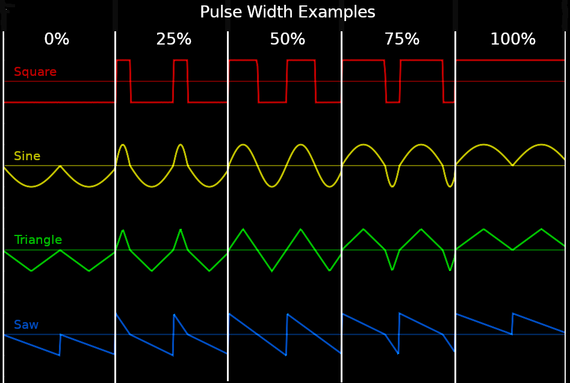

### PWM (pulse width modulation) attenuverter knob and CV input
Provides CV control over the pulse width setting. The CV is scaled at 10% per volt. The CV is attenuated and or inverted by the associated attenuverter knob. The attenuated CV is summed with the PW setting, and the final effective pulse width is clamped to a value from 0 to 100%.

### SPICE SKEW button
When enabled, the Spice Skew button causes the Slice pulse width to modulate the frequency of the Spice frequencies. Positive Spice frequency is decreased as the pulse width increases, and increased as the pulse width decreases. The Negative Spice frequency is modulated in reverse, increasing as the pulse width increases, and decreasing as the pulse width decreases. See [PW Skew in the Spice oscillators section](#pw-skew-spice-frequency-modulation) for more information.

### EXP FM (exponential frequency modulation) input and attenuverter
The Slice exponential frequency modulation input is scaled at 1 V/Oct, and it can be attenuated and/or inverted by the attenuverter.

### LIN FM (through zero linear frequency modulation) input and attenuverter
By default the Slice linear frequency modulation is AC coupled, meaning that low frequency content is blocked by a high pass filter. If you need to use low frequency linear FM, then activate the small **DC** button. The button will turn blue, and the linear FM input is then DC coupled.

### SYNC (hard sync) input
The rising edge of a trigger or gate at the Slice Sync input resets the Slice oscillator phase to 0. The sync uses a Schmitt trigger that goes high when the input rises above 2 volts and goes low when the input falls below 0.2 volts.

### SQR (square), SIN (sine), TRI (triangle), and SAW (descending ramp) outputs
Each of the Slice waveforms are available at these outputs. All slice waveforms are bipolar 10 volts peak to peak (-5V to 5V).

## POSITIVE and NEGATIVE SPICE oscillator sections
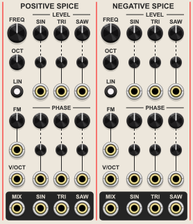  
The controls, inputs, and outputs are identical for the Positive and Negative Spice oscillators.

The Positive and Negative spice oscillators each produce three different unipolar waveforms simultaneously
- **SIN** - Actually a fully rectified sine so the frequency is effectively double the rate of the other spice waveforms
- **TRI** - Triangle
- **SAW** - A descending ramp waveform

The Positive Spice waveforms range from 0 to 5 volts, and the Negative Spice waveforms range from -5 to 0 volts.

There are raw outputs for each of the Spice waveforms.

The diagram below demonstrates the shapes, phase relationships, and sync behavior of all six raw Spice waveforms. The Positive and Negative oscillators are at the same frequency, and the Spice Sync button is enabled in the Slice section. Note how the Positive Spice is synced at the rising edge of the Slice square wave, and the Negative Spice is synced at the falling edge of the Slice square wave. Spice Sync is typically not useful when the Slice frequency is higher than the Spice frequencies. But when Slice is slower, the sync can produce harmonious results regardless what Spice frequencies are chosen.

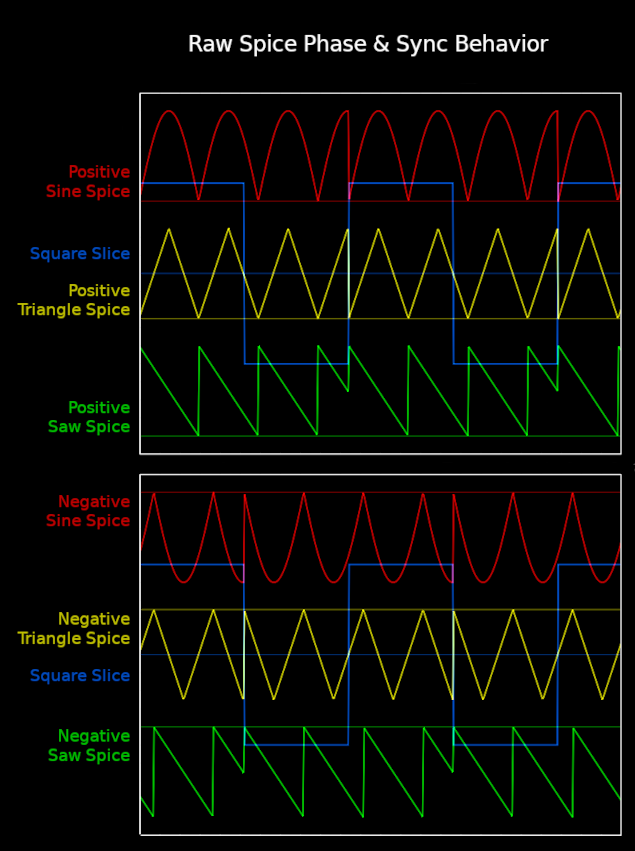

### FREQ (Positive/Negative spice frequency) knob
The Freq knob adjusts the base frequency of the Positive or Negative Spice oscillator. The knob has an 8 octave range. The absolute values of the range depend on the settings of the Spice Oct (octave) knob and Slice Slow button (from the Slice Oscillator section). With the Octave at 0 and the Slow option off, the knob ranges from 16.352 to 4186 Hz, with the default noon position at C4 (261.63 Hz). With the Octave at 0 and the Slow option enabled, the knob ranges from 0.125 to 32 Hz, with the default noon position at 2 Hz.

### OCT (Positive/Negative Spice octave) knob
Adjusts the range of the Positive or Negative Spice Frequency knob in one octave increments. The Octave knob ranges from -2 to 2, with the default noon position at 0.

### V/OCT (Positive/Negative Spice volt/octave) input
The Spice V/Oct input is summed with the Freq and Oct values to determine the effective Spice frequency.

If the Spice Track button is enabled in the Slice oscillator section, then the Slice V/Oct input also contributes to the Spice frequency.

### LEVEL (Positive/Negative waveform mix level) knobs, inputs, and attenuverters
The Positive and Negative Spice oscillators each have a set of mix controls for the sine, triangle, and saw waveforms. The controls determine both how much of each waveform is included in the Positive or Negative Spice Mix, and to what degree the waveforms are switched on and off by the Slice oscillator.

The Positive Spice waveforms are switched on when the Slice oscillator is high, and off when Slice is low. The Negative Spice waveforms are switched on when the Slice oscillator is low, and off when Slice is high. The switching is achieved via amplitude modulation. The half rectified positive portion of the Slice waveform amplitude modulates the Positive Spice waveforms. The half rectified negative portion of the Slice waveform is inverted and then amplitude modulates the Negative Spice waveforms.

The Level controls range from 0% to 100%. At 0% the waveform is completely off. Between 0% and 50% the waveform is fully switched, with the amplitude smoothly increasing until the maximum 5V peak to peak level is reached at 50%. At 100% the waveform is at maximum amplitude but without switching. Between 50% and 100% the signal sort of cross fades between the fully switched maximum amplitude and the unswitched maximum amplitude. In actuality the unswitched waveform is attenuated between 0% and 100%, and the maximum of the maximum switched signal and the attenuated unswitched signal is used.

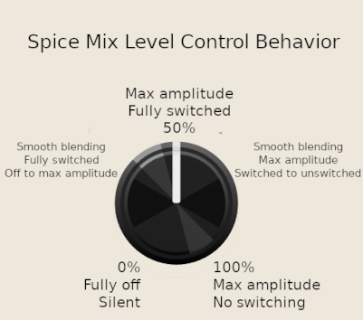

The Spice Mix Level CV inputs are scaled at 10% per volt, and attenuated and/or inverted by the associated small attenuverter knob. The attenuated CV is then summed with the Spice Mix Level knob value and the result is clamped to a value between 0% and 100%.

The effect of the Slice switching depends on whether the Slice oscillator frequency is lower or higher than the Spice oscillators.

In the waveform trace below the Slice frequency is lower than both Spice oscillators, and the Spice Sync from the Slice oscillator section is On.

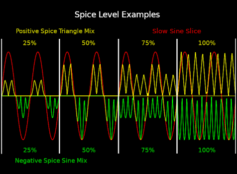

In the waveform trace below the Slice frequency is higher than both Spice oscillators, and the Spice Sync from the Slice oscillator section is off. The Spice Sync option is typically not useful when the Slice frequency is higher than the Spice.

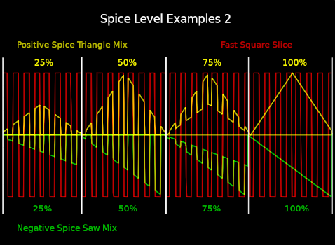

The examples above each use a single waveform for the Positive and Negative Spice mixes. But multiple waveforms can be blended and the mixed results appear at the Positive/Negative Spice Mix outputs.

### FM (Positive/Negative Spice frequency modulation) inputs and attenuverter knobs
The FM inputs are attenuated and/or inverted by the associated attenuverter knobs, and they can modulate the Positive and Negative Spice oscillator frequencies at audio rates.

### LIN (Positive/Negative Spice FM mode) buttons
The LIN buttons control the type of FM applied to the Spice oscillators. There are three possible values:
- **Off** - DC coupled exponential frequency modulation
- **Yellow** - AC coupled through-zero linear frequency modulation
- **Blue** - DC coupled through-zero linear frequency modulation

### PW Skew Spice frequency modulation
If the Spice Skew button is enabled in the Slice Oscillator section, then the Slice pulse width modulates the frequency of the Spice frequencies. Positive Spice frequency is decreased as the pulse width increases, and increased as the pulse width decreases. The Negative Spice frequency is modulated in reverse, increasing as the pulse width increases, and decreasing as the pulse width decreases. If the Spice Sync is also active, then the overall shape of the positive and negative Spice mixes will remain constant as the frequencies are skewed.

The diagram below demonstrates how Spice Skew works. Both Spice Sync and Spice Skew are active for these examples. The upper portion of the yellow Splice mix is from the Positive Spice mix, and the bottom portion is from the Negative Spice mix. Note how the wavelengths of the Positive Spice component increase proportionally as the pulse width increases, while the Negative Spice wavelengths decrease. Also note how there is no Positive Spice component when the pulse width is 0%, and no Negative Spice component when the pulse width is 100%.

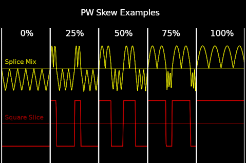

### PHASE (Positive/Negative Spice waveform phase) knobs, inputs, and attenuverters
The phase of each Spice waveform can be adjusted via the Phase knobs. The phase knobs range from -180 to 180 degrees, with the default noon value of 0 degrees.

The associated CV inputs are scaled at 90 degrees per volt, and are attenuated and/or inverted by the associated attenuverters. The attenuated CV is summed with the knob value to get the effective phase.

Spice waveform phases can be modulated at audio rates.

### SIN (sine), TRI (triangle), and SAW Spice raw outputs
These six outputs produce the the raw waveforms of the Positive and Negative Spice oscillators, without any amplitude modulation from the Mix Level controls. All of the raw outputs are unipolar 5 volt peak to peak.

### MIX Spice outputs
These two outputs produce the final mixes of the Positive and Negative Spice oscillators after the Spice mix levels have been applied. These outputs are also unipolar, but the amplitude can vary depending on the settings of the mix level controls. These mixes are the signals that are passed to the Splice mixer section for merging.

## SPLICE mixer section
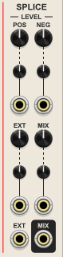

The Splice mixer is where the Positive and Negative Spice unipolar mixes are merged into a final bipolar signal. There is also the option to mix in an additional external or feedback signal into the final mix.

Below is a simple example of a final Splice mix where the Slice frequency is lower than both Spice frequencies. It is fairly easy to see how the final mix waveform has been created.

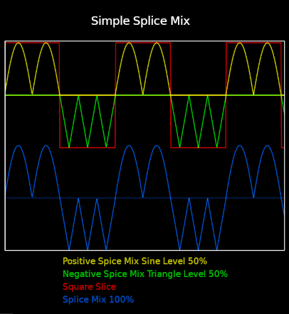

Below is a more complex example of a final Splice mix where the Slice frequency is higher than the Positive Spice frequency, but lower than the Negative Spice frequency. It is much more difficult to look at the final mix and see how it was created, yet the source components are still fairly simple without any modulation. Much more complicated outputs are possible.

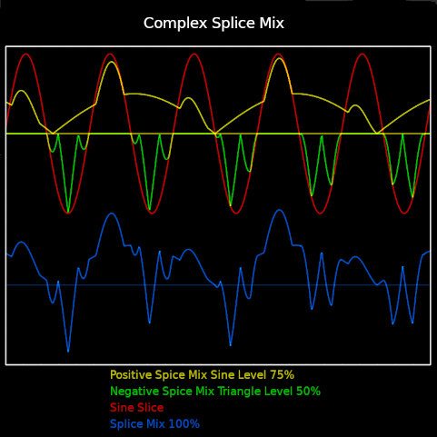

### POS and NEG (Positive/Negative Spice mix) splice level knobs, inputs, and attenuverters
Specifies how much of the Positive and Negative Spice mixes are included in the final Splice mix. The knobs range from 0 to 100%. The CV inputs are scaled at 10% per volt, and are attenuated and/or inverted by the associated attenuverters. The attenuated CV is summed with the knob value and then clamped to an effective mix level between 0 and 100%.

Having independent control of the Positive and Negative Spice mix levels can be useful for maintaing a 10V peak to peak final Splice mix because the amplitude of the incoming Spice mixes can vary widely.

### EXT (external) input
This input provides a means of inserting an additional signal into the final Splice mix.

### EXT (external) splice level knob, input, and attenuverter
Specifies how much of the external signal is included in the final Splice mix. The knob ranges from 0 to 100%. The CV input is scaled at 10% per volt, and is attenuated and/or inverted by the associated attenuverter. The attenuated CV is summed with the knob value and then clamped to an effective mix level between 0 and 100%.

### MIX level knob, input, and attenuverter
Specifies the level of the final Splice mix. The knob ranges from 0 to 100%. The CV is scaled at 10% per volt, and is attenuated and/or inverted by the associated attenuverter. The attenuated CV is summed with the knob value and then clamped to an effective final mix level between 0 and 100%.

### MIX output
This is the final Splice mix output.

## Known differences from the FSS OSC2

Here is a summary of the major known differences between the Future Sound Systems OSC2 and the Venom Spice Factory.

- Scissor has been renamed Slice
- Positive DNA has been renamed Positive Spice
- Negative DNA has been renamed Negative Spice
- Glue has been renamed Splice
- PW Skew has been renamed Spice Skew
- CV Lock has been renamed Spice Track
- Sync Lock has been renamed Spice Sync
- Spice Factory is fully polyphonic
- Since Spice Factory is a digital implementation, it has upper frequency limits, and is subject to aliasing. But oversampling is available to mitigate aliasing.
- A sine waveform was added to the Slice oscillator
- Any of the Slice oscillator waveforms can be used to slice the Spice waveforms via amplitude modulation, not just the square waveform
- Pulse width modulation can be applied to the Slice sine, triangle, and saw waveforms, not just the square waveform
- All VCV knobs have a fine control mechanism, so the Slice and Spice sections have Frequency and Octave knobs instead of Course and Fine frequency controls
- The Slice has one dedicated exponential FM input and one dedicated linear FM input instead of two FM inputs that can be configured to be linear or exponential
- All Venom linear FM is through-zero, and can be configured to be AC coupled or DC coupled. I believe the FSS linear FM is always DC coupled, and not through-zero
- Venom has an added Slice hard sync input
- Spice mix level CV inputs have added attenuverters
- Spice has added Phase controls and CV inputs with attenuverters, suitable for audio rate phase modulation
- The Venom Splice mixer has more controls and VCAs for greater control of the final Splice mix
