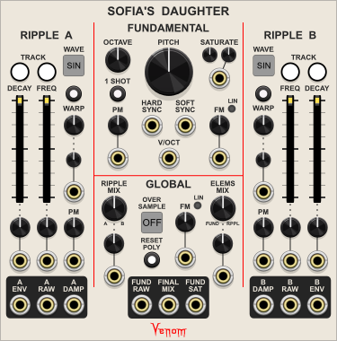

# VenomPremium
Documentation for Venom Premium Plugins for VCV Rack

# Sofia's Daughter
)  
A complex polyphonic formant oscillator inspired by the wonderful [XAOC Devices Sofia "1955 Transcendent Analog Waveform Oscillator"](http://xaocdevices.com/main/sofia). Sofia's Daughter implements all the basic functionality (though not necessarily the exact sound) of the XAOC hardware module, and then extends the functionality with additional controls, inputs, and outputs.

The underlying principle behind the module is FOF (fonction d'onde formantique) synthesis, a method of producing formant sounds through short bursts of decaying sinusoidal waveforms. The primary output of Sofia's Daughter consists of two such decaying sinusoidal waveforms, called Ripple elements, combined with a saturated sine wave called the Fundamental. The Fundamental triggers (hard syncs) the Ripple elements as well as their decay envelopes. The Ripple frequencies are measured as ratios of the Fundamenal frequency, and the Ripple decay length is proportional to the Fundamental wavelength. Sofia's Daughter extends the FOF synthesis by allowing waveforms other than sine for the Ripple elements.

Because the Ripple elements are always phase aligned with the Fundamental, the output can remain harmonious, regardless what frequency ratios are used for the Ripples.

Here is one example of an output waveform, along with the three component elements.
  

With these three basic building blocks, plus a bunch of modulation possibilities, Sofia's Daughter can produce an astonishing range of sounds. Of course the output works well with a VCA and Filter. But rich resonant sounds can be produced without a filter. And the Ripple envelopes allow for the creation of percussive and bell-like voices without the need of a VCA or external envelope generators.

