# Venom Chaos Boxes plugin
Venom Chaos Boxes [version 2.0.0](VenomChaosBoxesChangeLog.md) for VCV Rack 2 is copyright 2026 Dave Benham and licensed under the [VCV Rack End User License Agreement](LICENSE.md).

Thank you for your interest in the Venom Chaos Boxes plugin for VCV Rack 2. This is a collection of modules inspired by small analog hardware synthesizers that rely on simple circuits with multiple feedback sources to generate chaotic signals. Nothing is random, but the network of signals can be so dependent on starting conditions that there is no simple formula that predicts what the outcome will be at any specific moment.

There are three base modules, along with two variants, plus two expanders that work with the digital shift registers within all the base modules.

- Inspiration 1: the Lorre Mill Double Knot versions 2 and 3 by Will Schorre
  - [Hybrid Knot](#hybrid-knot)
- Inspiration 2: Rob Hordijk's Benjolin, specifically the After Later Audio Benjolin v2
  - [Venjolin](#venjolin)
  - [Venjolin Plus](#venjolin-plus)
- Inspiration 3: Rob Hordijk's Blippoo Box, specifically the 2018 version that is now available from BiyiBlip as the Blippoo Box Legacy
  - [Vlippoo Box](#vlippoo-box)
  - [Vlippoo Box Plus](#vlippoo-box-plus)
- Expanders exposing the underlying digital shift registers of each base module
  - [Chaos Gates Expander](#chaos-gates-expander)
  - [Chaos Volts Expander](#chaos-volts-expander)
  
The Hybrid Knot is available for $15.  
The Venjolin with its Plus variant is available for $15.  
The Vlippoo Box with its Plus variant is available for $20.  
Or the entire collection can be purchased for $40 (20% discount).

Both expanders are included with any purchase.

## Acknowledgments
First and foremost I must thank Rob Hordijk for his amazing creations, may he rest in peace.

A huge thanks to all the hardware synth makers for giving me permission to publish these digital emulations. If you enjoy the Venom virtual synths you might be interested in acquiring the original hardware for some analog goodness.
- Will Schorre of Lorre Mill - creator of the [Double Knot](https://lorre-mill.com/doubleknot)
- Lenny Helton of After Later Audio - creator of the [Eurorack Benjolin V2](https://afterlateraudio.com/collections/vco/products/benjolin-v2)
- Biyi Amez of BiyiBlip - creator of the [Blippoo Box Legacy](https://www.youtube.com/watch?v=fMySwLdPzK8)

Thanks to my beta testers - It is not possible to release a quality product without good testing and feedback
- Don Cross (cosinekitty)
- Andreya Ek Frisk
- Stephan Muesch (rsmus7)
- Koen Kaptijn

In particular, the  would not sound as good as it does without the many contributions from Koen. Years ago we both started emulating the Blippoo Box using existing free VCV modules. We traded ideas, shared patches, and developed a basic understanding of how the Blippoo Box works. His involvement continued during development and testing of the Venom  module. Koen's insights were critical to the final product.

*[Venom Premium TOC](README.md#table-of-contents)*

# Hybrid Knot
*Quick Links: [Intro](#hybrid-knot) | [Oscillators](#oscillators) | [Clock](#clock) | [Shift registers](#shift-registers) | [Envelopes](#envelopes) | [VCAs](#vcas) | [Output](#main-output) | [Utilities](#utilities) | [Chaos Boxes](#venom-chaos-boxes-plugin) | [Venom Premium TOC](README.md#table-of-contents)*

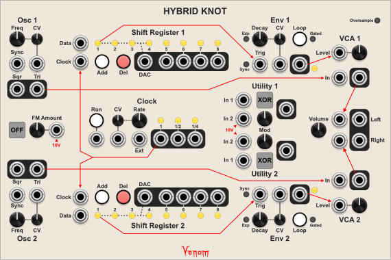  

The Hybrid Knot is my take on the [Lorre Mill Double Knot synthesizer](https://lorre-mill.com/doubleknot). There have been three versions of the Double Knot, each with its own set of unique features, but all sharing a similar basic architecture with simple functional blocks. The Double Knot encourages the owner to come up with creative ways to coax surprisingly complex sounds, sequences, and rhythms out of the simple set of components. It can produce drones, rigid sequences, or chaotic generative results depending on how it is patched.

The Hybrid Knot combines features from versions 2 and 3 of the Double Knot, with additional twists that are unique to the Hybrid Knot.

The Hybrid Knot has two voices, each consisting of an oscillator, shift register sequencer, decay envelope, and VCA. The voices are mirrored vertically, running across the top and bottom of the module. Running through the middle are components used by both voices: Cross modulation control, a clock, utilities, and a saturating final output volume control. All components except the utilities are pre wired internally, with red lines showing the normalled connections. Patching an input breaks any normalled connection to that port.

The Double Knot hardware uses banana cables that are typically stackable, so the VCV stackable input and output port behavior is very appropriate for the Hybrid Knot module.

Except where noted, Hybrid Knot inputs are DC coupled.

### Important fundamental differences from the Double Knot
The Double Knot hardware is pure analog with voltage limits, and many non-linearities. Oscillators do not respond 1V/Octave. Stacked outputs can experience voltage drop. Stacked inputs can overload circuits. Older versions of the Double Knot could not handle negative control voltage. Oscillators, envelopes, and the clock have wide but limited frequency ranges.

In contrast, the Hybrid Knot is pure digital, and no attempt was made to emulate analog circuitry. Oscillators, envelopes, and the clock all respond 1V/Octave. Stacked outputs do not suffer from voltage drop, so they behave like buffered mults. Stacked inputs sum with digital precision, and no voltage constraints. Oscillators, envelopes, and the clock have a wider frequency range. The maximum rate is only limited by the VCV sample rate. The minimum rate for the oscillators and clock are a bit over 3 minutes per cycle. Beyond that the oscillation will stall due to limitations of floating point math. But the envelope lengths are virtually unlimited due to the use of double precision floating point.

Note that if oversampling is enabled then very high frequency output can be sharply attenuated by the oversampling low pass filter.

### Oversampling

Because Hybrid Knot is digital, it can generate high frequency content beyond the Nyquist frequency that can reflect down as undesired unharmonic harsh noise. The Oversampling button in the upper right corner can be used to set various levels of oversampling to mitigate digital aliasing. Oversampling can use a lot of CPU power, so it is best to use the lowest level of oversampling that sounds good for your patch.

- **Off** ***(dark gray)***
- **x2** ***(yellow, default)***
- **x4** ***(green)***
- **x8** ***(light blue)***
- **x16** ***(dark blue)***
- **x32** ***(purple)***

All Hybrid Knot inputs are upsampled with interpolation to the selected oversample rate. All outputs are passed through a low pass filter set to 40% of the VCV sample rate before being downsampled to the native VCV sample rate.

### Context menus

#### Save shift register states
By default the shift registers are cleared when a patch is first loaded. The "Save shift register states" option causes the shift register values to be stored with the patch so the sequencer resumes where it left off when the patch is reloaded.

#### Expander options
There are four options to add [Chaos Gates](#chaos-gates-expander) and/or [Chaos Volts](#chaos-volts-expander) expanders to the left or right of the Hybrid Knot. The expanders give access to the underlying shift register bits. Expanders to the left use the voice 1 (top) shift register, and expanders to the right use the voice 2 (bottom) shift register.

#### Standard context menu options
Venom Themes, Custom Names, and Parameter Locks and Custom Defaults are available via [standard Venom context menu options](README.md#standard-venom-context-menus) that are common to all Venom modules.

*Quick Links: [Intro](#hybrid-knot) | [Oscillators](#oscillators) | [Clock](#clock) | [Shift registers](#shift-registers) | [Envelopes](#envelopes) | [VCAs](#vcas) | [Output](#main-output) | [Utilities](#utilities) | [Chaos Boxes](#venom-chaos-boxes-plugin) | [Venom Premium TOC](README.md#table-of-contents)*

## Oscillators
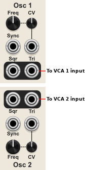  
There are two identical oscillators with an extremely wide frequency range. The oscillators are the default source of sound for the Hybrid Knot.

### FREQ (Frequency) knob
Sets the base frequency of the oscillator. The knob ranges from ~1 Hz to ~16 kHz.

### CV input and knob
The CV input is attenuated by the bipolar attenuverter knob and then modulates the oscillator frequency using a 1V/Octave scale. The oscillator can be modulated both above and below the knob frequency limits.

### Sync (soft sync) trigger input
The leading edge of a trigger soft syncs the oscillator. The trigger goes high when the input reaches 2.5V, and returns to a low state when dropping below 0.2V.

The Hybrid Knot uses wave reversal soft sync. I do not know what type of soft sync the Double Knot uses.

The Sync input is AC coupled.

### Sqr (Square) output
The bipolar +/-5V square wave oscillator output with a 50% duty cycle.

### Tri (Triangle) output
The bipolar +/-5V triangle wave oscillator output.

The triangle output is internally routed to the corresponding VCA input by default.

*Quick Links: [Intro](#hybrid-knot) | [Oscillators](#oscillators) | [Clock](#clock) | [Shift registers](#shift-registers) | [Envelopes](#envelopes) | [VCAs](#vcas) | [Output](#main-output) | [Utilities](#utilities) | [Chaos Boxes](#venom-chaos-boxes-plugin) | [Venom Premium TOC](README.md#table-of-contents)*

## FM Cross Modulation
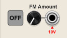  
This section controls how much the oscillator triangle outputs modulate each other's frequency. The frequency modulation is exponential.

### Square (unlabeled) button
Controls the routing of the cross modulation
- **OFF** ***(default)*** - Cross modulation is disabled
- **1<2** - Oscillator 2 modulates oscillator 1 frequency
- **1>2** - Oscillator 1 modulates oscillator 2 frequency
- **1<>2** - Each oscillator modulates the other's frequency

### FM Amount input and knob
Controls the amount of frequency modulation by attenuating the modulation signal. This functions as a standard 2 quadrant VCA. An input of 10V equals 100%, and the unipolar knob attenuates the control voltage. The input is normalled to 10V, so if unpatched the knob directly controls the ammount of modulation. This is diffent behavior than the hardware. The Hybrid Knot hardware sums the input with the knob value.

*Quick Links: [Intro](#hybrid-knot) | [Oscillators](#oscillators) | [Clock](#clock) | [Shift registers](#shift-registers) | [Envelopes](#envelopes) | [VCAs](#vcas) | [Output](#main-output) | [Utilities](#utilities) | [Chaos Boxes](#venom-chaos-boxes-plugin) | [Venom Premium TOC](README.md#table-of-contents)*

## Clock
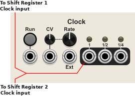  
This is a simple square wave oscillator with a 50% duty cycle and clock dividers. By default it is used to clock the shift register sequencers.

### Run button and trigger input
Controls whether the clock is running or not. Each press of the Run button toggles the run state. The button glows white when the clock is running.

The run state can also be triggered by the leading edge of a trigger at the input. The trigger goes high at 2.5V, and resets to low at 0.2V.

The current state of the clock outputs remain fixed while the clock is not running, but the internal oscillator continues to oscillate. The internal oscillator is not reset when the clock is started.

The Run button is exclusively a Double Knot version 3 feature. The Run trigger input is not available in any Double Knot hardware version.

### Rate knob
Controls the base rate of the internal clock oscillator. The knob ranges from ~0.25 Hz to ~64 Hz.

### CV input and knob
The CV input modulates the internal clock oscillator rate at 1V/Octave. The CV knob attenuates the input.

The internal clock can be modulated to very low LFO rates and high audio rates.

### Ext (External clock) input

The external clock replaces the internal clock signal. The input uses a Schmitt trigger to determine the start and end of each clock pulse. The clock goes high at 2.5V and resets to low at 0.2V.

The Rate knob and CV input serve no purpose when using an external clock.

### Clock outputs and LED lights
The clock outputs are unipolar 0-10V gates. The LED above each output indicates the state of that output.

#### 1 Output
The base clock output. By default this is internally routed to both shift register clock inputs.

#### 1/2 Output
The base clock divided by two.

#### 1/4 Output
The base clock divided by four.

The divided clock outputs were only available in the Double Knot version 2. They are not availble in version 3 of the hardware.

The XOR logic functionality in the Double Knot version 2 clock is available in the Utilities section of the Hybrid Knot.

*Quick Links: [Intro](#hybrid-knot) | [Oscillators](#oscillators) | [Clock](#clock) | [Shift registers](#shift-registers) | [Envelopes](#envelopes) | [VCAs](#vcas) | [Output](#main-output) | [Utilities](#utilities) | [Chaos Boxes](#venom-chaos-boxes-plugin) | [Venom Premium TOC](README.md#table-of-contents)*

## Shift Registers
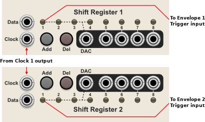  
Each voice has an eight stage digital shift register that functions as a sequencer. The first stage of the shift register is routed to the corresponding envelope trigger input by default.

By default all shift registers start out cleared when a patch is loaded. There is a "Save shift register states" module context menu option that allows the sequencer to pick up where it left off when the patch is reloaded. This is particularly useful when you configure the shift register to loop a repeating sequence.

### Data input
This is the data source for the shift register. The input uses a Schmitt trigger that transitions to high at 2.5V and resets to low at 0.2V.

### Clock trigger input
This is the signal that triggers the shift register to advance. A Schmitt trigger is used that transitions to high at 2.5V and resets to low at 0.2V. The shift register advances when the clock transitions from low to high. This input is normaled to the clock 1 output.

When the shift register advances, stages 1 through 7 values shift one place to the right, the stage 8 value falls off, and the instantaneous state of the Data input is shifted into stage 1.

### Add button
When this momentary button is pressed it overrides the Data input with a high value. This means each time the clock input is triggered while the button is pressed a high value is shifted into stage 1.

### Del (Delete) button
When this momentary button is pressed it overrides the Data input with a low value. This means each time the clock input is triggered while the button is pressed a low value is shifted into stage 1.

The Del button takes precedence over the Add button.

### LED lights
The eight LED lights show the current state of each stage of the shift register. Each LED glows bright yellow when the stage is high.

The Double Knot hardware only has LEDs for stages 1, 5, 6, 7, 8.

### DAC output
This is a unipolar 0-10V stepped wave output with 16 evenly spaced values possible. The signal is produced by a Digital to Analog Converter (DAC). The dotted lines between the LEDs show that the DAC uses stages 1 through 4 to produce the DAC output.

The signal is often used to control the frequency of an oscillator, but it could be used to modulate anything. It could even be used as a sound source if the shift register is clocked at audio rates.

### Stage ouputs 5, 6, 7, 8
These unipolar 0-10V pulse outputs represent the state of the last four stages of the shift register. You can patch one of the stage outputs to the Data input to set up a repeating sequence. The stage outputs can also be used as modulation or audio signals as you see fit.

*Quick Links: [Intro](#hybrid-knot) | [Oscillators](#oscillators) | [Clock](#clock) | [Shift registers](#shift-registers) | [Envelopes](#envelopes) | [VCAs](#vcas) | [Output](#main-output) | [Utilities](#utilities) | [Chaos Boxes](#venom-chaos-boxes-plugin) | [Venom Premium TOC](README.md#table-of-contents)*

## Envelopes
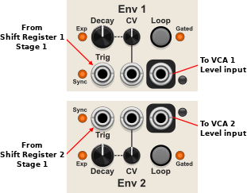  
Each voice has a simple decay envelope with an instantaneous rise to 10V and then a gradual decay back to 0V. By default it is used to control the level of the corresponding VCA.

The envelopes are called Envelopers in the Double Knot manual. The Hybrid Knot does not implement the velocity feature of the Double Knot version 3 enveloper.

### Trig (Trigger) button
This Schmitt trigger input controls when the envelope is triggered. The trigger goes high at 2.5V and resets to low at 0.2V. The actual trigger action can be affected by the Loop, Sync, and Gated buttons.

The Trig input is normalled to stage 1 of the corresponding shift register.

The envelope can be retriggered while the previous envelope is still decaying.

### Decay knob
Sets the base decay time for the envelope. Counter-clockwise rotation produces shorter decay times, and clockwise rotations give longer decay times. This arrangement is the inverse of the Double Knot hardware. 

Decay is called Sink in the Double Knot.

### CV input and knob
The CV modulates the decay time, with each positive volt doubling the time, and each negative volt cutting the time in half. The bipolar knob attenuates and/or inverts the CV level.

The CV can modulate the decay time well beyond the range of the Decay knob.

### Loop button
If enabled (glowing white) then the envelope automatically retriggers when the envelope returns to 0 volts. The exact behavior of the loop changes depending on the setting of the Sync and Gated buttons.

### Exp (Exponential) button
When enabled (orange), the decay curve is exponential (concave up). When disabled the decay is linear.

The button is enabled by default.

Changing between linear and exponential does not affect the decay time for the Hybrid Knot envelopes. The Double Knot hardware behaves differently in that exponential envelopes are shorter than their linear counterparts.

The option for exponential or linear decay is a feature of the Double Knot hardware version 3. The hardware uses a dip switch.

### Sync button
When enabled (orange), each envelope trigger is delayed until the corresponding VCA input crosses 0V. This is done to minimize clicks in the output that can arise from the instant envelope attack. If the trigger goes low before the VCA input crosses 0 then the trigger is ignored.

When disabled the envelope trigger is immediate.

The sync option is a feature of the Double Knot hardware version 3. The hardware uses a dip switch. Lorre Mill calls it "zero crossing" vs. "phase irreverent".

### Gated button
When enabled (orange), the triggers are gated by the corresponding shift register clock. This is true regardless where the trigger is coming from. If also in loop mode, then the envelope will only loop while both the shift register clock and the trigger input are high. The Gated button is enabled by default.

When disabled the trigger input is not gated, meaning that consecutive high input from the shift register will only result in a single envelope. If loop mode is enabled, then the envelope will loop indefinitely, without the need of any trigger.

The Double Knot hardware does not have this option. Double Knot envelope triggers are always gated by the shift register clock.

### Interaction of Loop and Gated buttons
|Loop button|Gated button|Result
|---|---|---|
|Off|On|(default settings) Consecutive high gate triggers from the shift register result in a separate trigger for each shift register clock trigger|
|Off|Off|Consecutive high gate triggers from the shift register result in only one envelope trigger|
|On|On|Once triggered, the envelope can loop for as long as the clock gate remains high. This is good for creating ratcheting effects|
|On|Off|The envelope loops indefinitely without the need of any trigger|

### Unlabled output and LED
This is the final unipolar envelope output. The intensity of the LED light next to the output is proportional to the current level of the envelope.

The envelope output is routed to the corresponding VCA Level input by default.

*Quick Links: [Intro](#hybrid-knot) | [Oscillators](#oscillators) | [Clock](#clock) | [Shift registers](#shift-registers) | [Envelopes](#envelopes) | [VCAs](#vcas) | [Output](#main-output) | [Utilities](#utilities) | [Chaos Boxes](#venom-chaos-boxes-plugin) | [Venom Premium TOC](README.md#table-of-contents)*

## VCAs
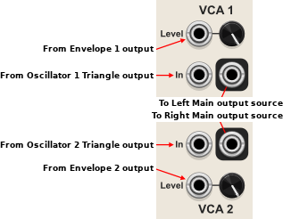  
Each voice has a standard 2 quadrant VCA that by default attenuates the oscillator triangle wave by the decay envelope coupled with the user selected level and forwards the result to the main output. But input and output ports allow the VCA to be totally rerouted.

The Double Knot version 3 VCA is totally hard wired without any user interaction. The Double Knot version 2 provides a level control and input, but no signal input or output rerouting capabilities.

### In input
This is the signal to be attenuated. It is normalled to the corresponding oscillator triangle output.

### Level input and knob
The unipolar Level CV is linearly scaled at 10V = 100%, and is attenuatted by the unipolar Level knob. The final effective level is the scaled CV level times the Level knob value.

The CV input is normalled to the corresponding Envelope output.

### Unlabled output
The output of the VCA is by default routed to the Main output, with the top voice going to the left (top) source input, and the bottom going to the right (bottom) source input.

*Quick Links: [Intro](#hybrid-knot) | [Oscillators](#oscillators) | [Clock](#clock) | [Shift registers](#shift-registers) | [Envelopes](#envelopes) | [VCAs](#vcas) | [Output](#main-output) | [Utilities](#utilities) | [Chaos Boxes](#venom-chaos-boxes-plugin) | [Venom Premium TOC](README.md#table-of-contents)*

## Main Output
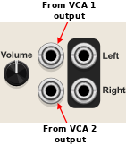  
The stereo main output has a volume control, and the output is limited to +/-6 V via a saturating tanh limiter.

The Double Knot hardware provides volume control of the stereo output, but does not have any source rerouting capability.

### Volume knob
The volume knob controls the gain of the incoming signals before being passed through a tanh limiter. The gain ranges from 0% to 200%.

### Unlabeled source inputs
The top (left) input is normalled to the voice 1 (top) VCA output. The bottom (right) input is normalled to the voice 2 (bottom) VCA output.

The inputs are AC coupled.

### Left and Right outputs
The final outputs are limited to +/-6 V by the tanh limiter.

*Quick Links: [Intro](#hybrid-knot) | [Oscillators](#oscillators) | [Clock](#clock) | [Shift registers](#shift-registers) | [Envelopes](#envelopes) | [VCAs](#vcas) | [Output](#main-output) | [Utilities](#utilities) | [Chaos Boxes](#venom-chaos-boxes-plugin) | [Venom Premium TOC](README.md#table-of-contents)*

## Utilities
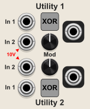  
The Hybrid Knot includes two configurable utility functions that do nothing without user patching.

Each utility consists of a square button to select the function, two inputs, a modulation knob, and a final output.

The Double Knot version 3 has two utilities that can be independently convigured as either a VCA or slew limiter via dip switches. The Double Knot version 2 does not have a utility section, though it does have an XOR gate function built into the clock.

### Unlabeled square button
Controls the function of the utility
- **XOR** ***(default)*** - An XOR (exclusive or) logic gate
- **VCA** - A 4 quadrant (bipolar) VCA capable of ring modulation
- **Slew** - A slew limiter
- **A>B** - A comparator that outputs 10 V if A>B, or 0 V otherwise

#### XOR mode
In 1 is the first input. In 2 is the second input, and is normaled to 10V.

The inputs are converted to a high (true), or low (false) value by a Schmitt trigger that goes high at 2.5 V and resets to low at 0.2 V.

The result is high (10 V) if the input states are different, meaning one input is high and the other is low. The result is low (0V) if the input states are the same, meaning both are high or both are low.

The bipolar Mod knob attenuates and/or inverts the result to a value between -10 V and 10 V. Since the low voltage will always be 0, it serves to set the voltage of a high output.

Because the 2nd input is normalled to 10 V, the XOR mode can function as a user selectable constant voltage source when both inputs are unpatched. A constant voltage is useful for biasing a voice VCA Level to produce a drone. The envelope can be stacked on top to create louder stabs. A negative constant voltage can be used to stack on top of a unipolar CV to convert it to bipolar.

If the first input is patched but the second input is unpatched, then the XOR mode can function as a NOT gate, turning a high input into a low output, and a low input into a high output. This can be used to turn a shift register into a 16 step looping sequencer by patching the stage 8 output to the XOR In1, setting the knob to 100%, and patching the XOR output to the shift register Data input.

#### VCA mode
In 1 is the signal input to be attenuated, amplified, and/or inverted.

In 2 is the bipolar Level CV input. It is linearly scaled at 10 V equals 100%, and -10 V equals -100%

Mod is a bipolar attenverter for the CV, ranging from -200% to 200%.

The final output is the input signal multiplied by the scaled Level CV times the Mod knob value. If the In 2 is unpatched then the Mod knob controls the level directly.

#### Slew mode
In 1 is the signal input to be slewed.

The unipolar Mod knob sets the base time it takes for the signal to rise or fall 1 volt. The knob scale is arbitrary. Clockwise rotations take longer. Counter-clockwise rotations rise or fall faster. Note that this is opposite from how the Double Knot version 3 Slew utility behaves.

In 2 unipolar CV is clipped to a value between 0 and 10 volts. It attenuates the slew rate in a rather odd way. 10 volts is 100%, meaning the knob slew rate is unattenuated. Each volt less than 10 approximately cuts the slew time in half. It is not possible to increase the slew time beyond the current Mod knob setting. This CV behavior is totally different from how the Double Knot version 3 slew works, where it adds the CV to the knob value.

Since In 2 is normalled to 10 V, the knob simply sets the slew time if In 2 is unpatched.

The slew utility can be used to convert a gate into an attack, sustain, release envelope. It can also be used to convert a square waveform into a triangle or trapezoid for use as CV or audio.

#### A>B Comparator mode
In 1 is the A signal

In 2 is the B signal, and it is normalled to 10V.

The bipolar Mod knob attenuates and or inverts the B signal between -100% and 100%.

The output is 10V if the A signal is greater than the attenuated B signal, otherwise it is 0V.

None of the Double Knot hardware versions contain a comparator function.

*Quick Links: [Intro](#hybrid-knot) | [Oscillators](#oscillators) | [Clock](#clock) | [Shift registers](#shift-registers) | [Envelopes](#envelopes) | [VCAs](#vcas) | [Output](#main-output) | [Utilities](#utilities) | [Chaos Boxes](#venom-chaos-boxes-plugin) | [Venom Premium TOC](README.md#table-of-contents)*

# Venjolin
*Quick Links: [Intro](#venjolin) | [Config](#configuration-section) | [Osc1](#osc1-oscillator-1-section) | [Osc2](#osc2-oscillator-2-section) | [Rungler](#rungler-section) | [Filter](#filter-section) | [Expanders](#expander-behavior) | [Venjolin-Benjolin Differences](#differences-from-the-after-later-audio-benjolin-v2-hardware) | [Chaos Boxes](#venom-chaos-boxes-plugin) | [Venom Premium TOC](README.md#table-of-contents)*

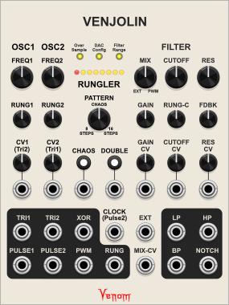  
The Venjolin emulates a small analog hardware synth called the Benjolin that was invented by Rob Hordijk. He published the [original design specs](https://electro-music.com/forum/topic-38081.html) in 2009. It is a non-traditional / experimental electronic musical instrument that uses a small number of simple circuits and a minimal number of knobs to create an astonishing range of sounds and patterns. Extensive use of feedback and cross-modulation makes the Benjolin a chaotic sound source, with the ability to create stable patterns as well.

There have been many variations of the Benjolin, but the basic functional architecture is always the same - two oscillators, a specialized shift register construct called the Rungler, and a resonant state variable filter. Note that the oscillators intentionally do not respond 1V/Octave.

The Chaos Boxes Venjolin is specifically based on the Eurorack [Benjolin V2 by After Later Audio](https://afterlateraudio.com/products/benjolin-v2) in collaboration with Rob Hordijk. The Venjolin starts with the complete functional design of the Benjolin V2, and then [adds a few enhancements](#differences-from-the-after-later-audio-benjolin-v2-hardware). Note that the Venjolin is a purely digital construct emulating Benjolin functionality. No attempt was made to model any analog electronic components.

This documentation focuses on technical aspects of how it works. It does not explore how it can be used to make music.

The [After Later Audio Benjolin manual](https://cdn.shopify.com/s/files/1/0591/4309/4430/files/Benjolin_V2_Manual_-_Rev_B_-_Links.pdf?v=1690421061) is a fantastic resource for understanding the history and workings of the Benjolin, as well as for gaining knowledge on how to use the Benjolin to make music. Because the Venjolin emulates the same feature set, the manual is also a great resource for the Venjolin. Once you have gained experience with the digital Venjolin, you might be tempted to cross over to the hardware world and purchase the After Later Benjolin!

The Venjolin is arranged in four vertical sections, plus a small configuration section above the central Rungler section:
- [Configuration](#configuration-section)
- [Oscillator 1](#osc1-oscillator-1-section)
- [Oscillator 2](#osc2-oscillator-2-section)
- [Rungler](#rungler-section)
- [Filter](#filter-section)

## Configuration section
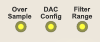  
Above the central Rungler section are there three small buttons for configuring some aspects of the Venjolin.

### OverSample button
Controls how much oversampling is applied to reduce digital audio aliasing in the outputs.
- **Low** ***(yellow, default)***
- **Med** ***(orange)***
- **High** ***(green)***

The values are all relative because the actual numeric value varies with VCV sample rate in an effort to give consistent results across all possible sample rates.

The default Low setting usually gives good results. But if the Venjolin is producing coherent high frequency output, then one of the higher settings may be appropriate, at the expense of higher CPU usage.

As part of oversampling, all outputs pass through a 12 pole low pass filter with a cutoff at 0.4 x VCV sample rate before being downsampled to the native sample rate. At a typical 48 kHz sample rate this equates to a cutoff at 19.2 kHz.

### DAC Configuration button
Controls which three shift register bits are used by the Digital to Audio Converter (DAC) to create the Rungler signal.
- **bits 6,7,8** ***(yellow, default)*** - Rob Hordijk's original design
- **bits 2,4,7** ***(blue)*** - alternate configuration that allows for more variability in Rungler patterns

### Filter Range button
Controls the range of the filter cutoff knob in the Filter section. Note that this does not alter the range that can be achieved via modulation.
- **Audio** ***(yellow, default)*** - 4 Hz - 16 kHz with default noon value of 250 Hz. This is most like the Benjolin hardware
- **Audio & LFO** ***(orange)*** - 0.06 Hz - 15.4 kHz with default noon value of 30 Hz.
- **LFO** ***(red)*** - 0.06 Hz - 64 Hz with default noon value of 2 Hz.

The second and third option may be useful when using the Venjolin to create LFO rate CV signals.

### Context menu options

***Add Venjolin+*** option  
You can use this menu option to add a [Venjolin Plus module](#venjolin-plus) to your patch. If you purchased the Venjolin then this is the only way to access the Venjolin Plus. If you purchased the entire Chaos Boxes plugin then you can access the Venjolin Plus through your module browser, and there is no need to use this option.

***Attenuator configuration*** option  
By default all modulation attenuator knobs are configured to be simple unipolar attenuators like the Benjolin hardware.

This option lets you configure the attenuators to be bipolar attenuverters.

***DC block filter outputs in "Audio" mode*** option  
When the filter is configured for the default yellow Audio range the filter outputs pass through a high pass filter to eliminate DC content by default. This option allows you to disable the DC blocker to be more like the Benjolin hardware, which can lead to a high DC component to the low pass filter output.

The DC blocker is never applied when using the orange Audio & LFO or red LFO ranges.

***Save shift register state*** option  
By default the shift register state is not saved with the patch. If this option is enabled then the shift register state is saved with the patch, which can be useful if you have found a repeating 8 or 16 step Rungler pattern that you like.

***Standard context menu options***  
Venom Themes, Custom Names, and Parameter Locks and Custom Defaults are available via [standard Venom context menu options](README.md#standard-venom-context-menus) that are common to all Venom modules.

*Quick Links: [Intro](#venjolin) | [Config](#configuration-section) | [Osc1](#osc1-oscillator-1-section) | [Osc2](#osc2-oscillator-2-section) | [Rungler](#rungler-section) | [Filter](#filter-section) | [Expanders](#expander-behavior) | [Venjolin-Benjolin Differences](#differences-from-the-after-later-audio-benjolin-v2-hardware) | [Chaos Boxes](#venom-chaos-boxes-plugin) | [Venom Premium TOC](README.md#table-of-contents)*

## OSC1 (Oscillator 1) section
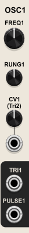  
The oscillator has an extremely wide frequency range with a minimum LFO rate of ~0.008 Hz (~2 minute period), and a maximum audio rate of 1/4 the VCV sample rate. So for a typical sample rate of 48 kHz, the maximum oscillator frequency would be 12,000 Hz.

### FREQ1 knob
Sets the base frequency of oscillator 1, prior to applying modulation. The frequency knob has a very wide range, with LFO rates counterclockwise from noon, and audio rates clockwise from noon. The minimum value is approximately 0.02 Hz (~ 50 second period). The default noon value is around 30 Hz. The maximum value is ~8550 Hz. However, if using a VCV sample rate less than 44 khz then the frequencies above 1/4 the sample rate will be unreachable.

### RUNG1 (Rungler 1) knob
Controls how much the rungler signal modulates oscillator 1 frequency. The knob may be a unipolar attenuator or a bipolar attenuverter, depending on the setting of the "Attenuator configuration" option in the module context manual. The dafult is a unipolar attenuator.

### CV1 (Control Voltage 1) knob and input
Bipolar input with a unipolar attenuator knob to modulate oscillator 1 frequency. If the context menu "Attenuator configuration" option is set to bipolar then the knob becomes a bipolar attenuverter.

The CV is ***not*** scaled at 1 volt per octave.

The CV1 input is normalled to the Oscillator 2 triangle output.

### TRI1 (Triangle 1) output
Triangle waveform bipolar output for oscillator one, ranging from -5 to 5 volts.

### PULSE1 output
Pulse waveform bipolar output for oscillator one, ranging from -5 to 5 volts.

*Quick Links: [Intro](#venjolin) | [Config](#configuration-section) | [Osc1](#osc1-oscillator-1-section) | [Osc2](#osc2-oscillator-2-section) | [Rungler](#rungler-section) | [Filter](#filter-section) | [Expanders](#expander-behavior) | [Venjolin-Benjolin Differences](#differences-from-the-after-later-audio-benjolin-v2-hardware) | [Chaos Boxes](#venom-chaos-boxes-plugin) | [Venom Premium TOC](README.md#table-of-contents)*

## OSC2 (Oscillator 2) section
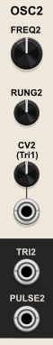  
The oscillator has an extremely wide frequency range with a minimum LFO rate of ~0.008 Hz (~2 minute period), and a maximum audio rate of 1/4 the VCV sample rate. So for a typical sample rate of 48 kHz, the maximum oscillator frequency would be 12,000 Hz.

### FREQ2 (Oscillator 2 Frequency) knob
Sets the base frequency of oscillator 2, prior to applying modulation. The frequency knob has a very wide range, with LFO rates counterclockwise from noon, and audio rates clockwise from noon. The minimum value is approximately 0.02 Hz (~ 50 second period). The default noon value is around 30 Hz. The maximum value is ~8550 Hz. However, if using a VCV sample rate less than 44 khz then the frequencies above 1/4 the sample rate will be unreachable.

### RUNG2 (Rungler 2) knob
Controls how much the rungler signal modulates oscillator 2 frequency. The knob may be a unipolar attenuator or a bipolar attenuverter, depending on the setting of the "Attenuator configuration" option in the module context manual. The dafult is a unipolar attenuator.

### CV2 (Control Voltage 2) knob and input
Bipolar input with a unipolar attenuator knob to modulate oscillator 1 frequency. If the context menu "Attenuator configuration" option is set to bipolar then the knob becomes a bipolar attenuverter.

The CV is ***not*** scaled at 1 volt per octave.

The CV2 input is normalled to the Oscillator 1 triangle output.

### TRI2 (Triangle 2) output
Triangle waveform bipolar output for oscillator two, ranging from -5 to 5 volts.

### PULSE2 output
Pulse waveform bipolar output for oscillator two, ranging from -5 to 5 volts.

*Quick Links: [Intro](#venjolin) | [Config](#configuration-section) | [Osc1](#osc1-oscillator-1-section) | [Osc2](#osc2-oscillator-2-section) | [Rungler](#rungler-section) | [Filter](#filter-section) | [Expanders](#expander-behavior) | [Venjolin-Benjolin Differences](#differences-from-the-after-later-audio-benjolin-v2-hardware) | [Chaos Boxes](#venom-chaos-boxes-plugin) | [Venom Premium TOC](README.md#table-of-contents)*

## RUNGLER section
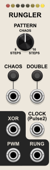  
The Rungler consists of an eight step digital shift register driven by a clock and a data input, along with comparators, logic gates, and a digital to analog converter (DAC). The rungler data input is always derived from the oscillator 1 triangle output. The clock input defaults to the oscillator 2 pulse output, but may be overridden at the clock input. When a bit shifts out of the shift register, it is XORed with the data input and fed back into the low bit of the shift register. The Rungler produces multiple output signals. Depending on configuration and the incoming data, the rungler output may be chaotic, or it may have a readily recognized pattern.

By default the Benjolin Oscillator DAC is configured to use bits 6,7,8 like Rob Hordijk's original design. But if the DAC Configuration button is in the orange mode then the DAC uses bits 2,4,7 instead, which increases the number of available Rungler patterns.

Above the Rungler label are eight LEDs representing the shift register bits. Off LEDs represent a low state, and on LEDs represent a high state. The left LED glows red, and represents bit 1, the XOR signal. The remaining LEDs glow yellow in two different intensities. Bright yellow indicates a bit used by the DAC, and dim yellow indicate unused bits.

### PATTERN knob
Controls whether the Rungler repeats a pattern or is chaotic. When fully anticlockwise, the Rungler produces an 8 step pattern. When fully clockwise it produces a 16 step pattern, with the last 8 steps being a mirror image of the first 8 steps. At noon the rungler output is chaotic.

Below is a technical discussion of how it works.

The Pattern knob range is from -1 to 1, with a default of 0 at noon. The raw internal triangle signal also ranges from -1 to 1. If the Pattern value is greater than the instantaneous incoming triangle value, then the rungler input is high (1), else the input is low (0). The input is XORed with the recycled shift register bit. So a high input inverts the recycled bit, and a low input preserves the recycled bit.

When the Pattern knob is fully counterclockwise, the input is guaranteed to be zero, the recycled bit is preserved, and an 8 step pattern is established.

When the Pattern knob is fully clockwise, the input is guaranteed to be 1, the recycled bit is inverted, and a 16 step pattern is established.

At noon there is a roughly 50-50 chance of 0 or 1, so the rungler output is at its most chaotic, typically with no recognizeable pattern.

### CHAOS button and input
If Chaos is enabled, the Pattern knob is ignored, and the rungler output is always chaotic. The Chaos button glows white when Chaos is enabled. 

Chaos mode works by converting the 8 step shift register into a 127 step linear feedback shift register, and by ignoring the Pattern knob and always comparing against 0, so there is always a 50% chance of inversion of the recycled bit. If Chaos is off, then the rungler may fall into a pattern over time, even if the Pattern knob is at noon. The Chaos mode is useful for re-introducing chaos into the output.

The Chaos input functions as a gate. If the input is >= 2V then Chaos is enabled, else it is disabled.

If the Chaos input is patched, then the Chaos button functions as a momentary switch that inverts the state of the Chaos input while the button is depressed.

If the Chaos input is not patched, then each press of the Chaos button toggles the state of the Chaos mode.

### DOUBLE button and input
If the Double mode is enabled then the Rungler is triggered at double the rate. Normally the Rungler is triggered by the rising edge of a clock gate. When in Double mode the Rungler is triggered by both the rising and falling edges of a clock gate. The Double button glows white when Double mode is enabled.

The Double input functions as a gate. If the input is >= 2V then Double is enabled, else it is disabled.

If the Double input is patched, then the Double button functions as a momentary switch that inverts the state of the Double input while the button is depressed.

If the Double input is not patched, then each press of the Double button toggles the state of the Double mode.

### CLOCK input

This is the input that triggers the Rungler shift register to advance. It is processed by a Schmitt trigger that detects a high state above 2V, and a low state below 0.2V. This arrangement allows the clock to work well with both unipolar and bipolar inputs.

The Clock input is normaled to the Oscillator 2 pulse output.

### XOR output

This is simply the first bit of the Rungler shift register, scaled and offset to be bipolar +/-5V. It is called XOR because the first bit is set to the state of the Triangle 2 compared to the Pattern value, and then XORed with the looped value that falls off the shift register.

### PWM output

This bipolar +/-5V output is produced by a comparator that outputs 5V when the TRI2 signal is greater than TRI1, and -5V otherwise. This is the signal that gets sent to the Venjolin filter input. It was called PWM by Rob Hordijk because it produces a series of variable width pulses, reminiscent of a pulse wave with pulse width modulation.

### RUNG (Rungler) output

The Rungler output is bipolar varying between +/-5V. It is a stepped voltage signal with 8 possible values created by the digital to analog converter in the Rungler.

*Quick Links: [Intro](#venjolin) | [Config](#configuration-section) | [Osc1](#osc1-oscillator-1-section) | [Osc2](#osc2-oscillator-2-section) | [Rungler](#rungler-section) | [Filter](#filter-section) | [Expanders](#expander-behavior) | [Venjolin-Benjolin Differences](#differences-from-the-after-later-audio-benjolin-v2-hardware) | [Chaos Boxes](#venom-chaos-boxes-plugin) | [Venom Premium TOC](README.md#table-of-contents)*

## FILTER section
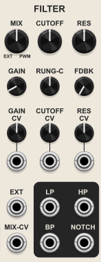  
The Venjolin uses a highly resonant 2 pole digital state variable filter that pings extremely well, but does not self-oscillate unless both resonance and feedback are both near maximum levels. The cutoff range is extremely wide, with a maximum cutoff at the lesser of 1/2 the VCV sample rate and 24 kHz. The Venjolin code does not specify a minimum cutoff value.

Note that all outputs, including filter outputs, subsequently pass through a frequency limiting low pass filter as part of oversampling so as to reduce aliasing. So unless VCV sample rates of 96 kHz or higher are used, the ultrasonic frequencies are effectively inaccessible even if the main filter allows them.

When the Filter Cutoff knob range is set to the default yellow audio range, the filter outputs are also by default sent through a high pass filter with a 20 Hz cutoff to remove DC offset from the outputs. There is a context menu option to disable the DC offset block.

### MIX knob
The Mix knob controls what signal is used as input to the filter. It cross fades between the external input and the PWM signal. The knob is scaled to read what percentage of the PWM signal is used in the mix. The external percentage is simply 100% - the PWM percentage. Fully clockwise is 100% PWM, fully counterclockwise is 0% PWM (100% external), and the default noon position is 50% PWM (50% external).

The mix can be modulated by the Mix CV.

If the external input is not patched, then the Mix knob can be used as a volume control.

### GAIN knob
Controls the base amount of gain applied to the filter input. The default is unity. The range is 0x to 10x. All filter outputs are soft clipped at +/- 10V using tanh clipping, so higher gains can be used to drive the output to saturation.

The base gain amount can be modulated by CV.

### GAIN CV input and attenuator knob
Bipolar input with a unipolar attenuator knob to modulate the filter input gain. If the context menu "Attenuator configuration" option is set to bipolar then the knob becomes a bipolar attenuverter.

The attenuated gain CV is summed with the main Gain knob value to establish the effective net input gain. The final effective gain value is clamped to a 0x to 10x range.

### EXT (External) input
This is the input for the external signal used by the Mix crossfade control.

### MIX-CV input
Bipolar input to modulate the Mix crossfade value. It is scaled at 10% per volt, and there is no attenuator for this input. The Mix CV is summed with the Mix knob to establish the net effective crossfade value. So if the Mix knob is at the default noon position (50% PWM), +5V will result in 100% PWM and -5V will result in 100% external.

The final effective Mix value is clamped to a 0% to 100% range.

### CUTOFF knob
Controls the base cutoff point where frequencies begin to be attenuated by the filter.

The range of the cutoff knob is controlled by the Filter Range button in the Configuration Section
- **Audio** ***(yellow, default)*** - 4 Hz - 16 kHz with default noon value of 250 Hz. This is most like the Benjolin hardware
- **Audio & LFO** ***(orange)*** - 0.06 Hz - 15.4 kHz with default noon value of 30 Hz.
- **LFO** ***(red)*** - 0.06 Hz - 64 Hz with default noon value of 2 Hz.

The cutoff value can be modulated beyond the knob range by both the Rungler signal and user supplied CV.

### RUNG-C (Rungler cutoff) knob
Controls how much the Rungler signal modulates the filter cutoff. The knob may be a unipolar attenuator or a bipolar attenuverter, depending on the setting of the "Attenuator configuration" option in the module context manual. The dafult is a unipolar attenuator.

### CUTOFF CV input and attenuator knob
Bipolar input with a unipolar attenuator knob to modulate the filter cutoff. If the context menu "Attenuator configuration" option is set to bipolar then the knob becomes a bipolar attenuverter.

The CV is ***not*** scaled at 1 volt per octave.

### RES (Resonance) knob
Controls the base amount of emphasis (amplification) applied to the cutoff frequency. The scale is arbitrary, with 0 being the minimum resonance, and 1 the maximum.

The Multimode Filter will never self oscillate unless band pass feedback is applied to the input. But with enough feedback and resonance applied, the oscillator will self oscillate at the cutoff frequency.

### FDBK (Feedback) knob
Controls the amount of band pass output that is fed back to the filter input. The feedback makes the filter more resonanant. Higher feedback values can make pings ring out longer. The filter will self oscillate at the cutoff frequency if both the resonance and feedback are near maximum.

Note that the internal feedback is not affected by the Gain.

### RES (Resonance) CV input and attenuator knob
Bipolar input with a unipolar attenuator knob to modulate the filter resonance. If the context menu "Attenuator configuration" option is set to bipolar then the knob becomes a bipolar attenuverter.

The attenuated resonance CV is summed with the base resonance knob to establish the effective resonance. The final effective resonance is clamped to the resonance knob's range.

### LP (Low Pass) output
Frequencies above the cutoff are attenuated by the filter.

### BP (Band Pass) output
Frequencies above and below the cutoff are attenuated by the filter.

### HP (High Pass) output
Frequencies below the cutoff are attenuated by the filter.

### NOTCH output
Frequencies at or near the cutoff are attenuated by the filter.

*Quick Links: [Intro](#venjolin) | [Config](#configuration-section) | [Osc1](#osc1-oscillator-1-section) | [Osc2](#osc2-oscillator-2-section) | [Rungler](#rungler-section) | [Filter](#filter-section) | [Expanders](#expander-behavior) | [Venjolin-Benjolin Differences](#differences-from-the-after-later-audio-benjolin-v2-hardware) | [Chaos Boxes](#venom-chaos-boxes-plugin) | [Venom Premium TOC](README.md#table-of-contents)*

## Expander Behavior
The Chaos Expanders give access to the underlying digital shift register within the Venjolin so as to produce user defined logic gates and/or control voltage. The Venjolin context menu has options to add [Chaos Gates](#chaos-gates-expander) and/or [Chaos Volts](#chaos-volts-expander) expanders to the right or left of the Venjolin. Since the Venjolin only has one shift register with one clock, the left expander behavior is identical to the right expander - it makes no difference which side is chosen.

*Quick Links: [Intro](#venjolin) | [Config](#configuration-section) | [Osc1](#osc1-oscillator-1-section) | [Osc2](#osc2-oscillator-2-section) | [Rungler](#rungler-section) | [Filter](#filter-section) | [Expanders](#expander-behavior) | [Venjolin-Benjolin Differences](#differences-from-the-after-later-audio-benjolin-v2-hardware) | [Chaos Boxes](#venom-chaos-boxes-plugin) | [Venom Premium TOC](README.md#table-of-contents)*

## Differences from the After Later Audio Benjolin V2 hardware
- The Venjolin sounds similar to the Benjolin, but the digital implementation certainly leads to differences from the analog hardware sound.
- The oscillator frequency ranges are very similar to, but not exactly the same as the hardware
- Addition of oversampling to mitigate audio aliasing that can result from the digital implementation
- Option for bipolar attenuators
- Option for alternative DAC configuration for greater Rungler pattern possibilities
- The scale of oscillator frequency modulation and filter cutoff modulation is probably different than the hardware
- Wider filter cutoff frequency range than the hardware
- Addition of resonance CV with attenuator
- Addition of internal band pass feedback control with CV and attenuator for greater resonance, to the point of self oscillation being possible without the need of a patch cable
- Addition of filter input gain control with CV and attenuator + built in tanh soft clipping (saturation)
- Addition of external input / PWM mix CV
- Addition of notch filter output
- Multiple filter cutoff range options to better facilitate use as a LFO rate CV source
- By default when the filter cutoff mode is in audio range it applies a DC block to remove a high DC component in low pass resonant pings. A context menu option is available to preserve the DC offset like the hardware.

*Quick Links: [Intro](#venjolin) | [Config](#configuration-section) | [Osc1](#osc1-oscillator-1-section) | [Osc2](#osc2-oscillator-2-section) | [Rungler](#rungler-section) | [Filter](#filter-section) | [Expanders](#expander-behavior) | [Venjolin-Benjolin Differences](#differences-from-the-after-later-audio-benjolin-v2-hardware) | [Chaos Boxes](#venom-chaos-boxes-plugin) | [Venom Premium TOC](README.md#table-of-contents)*

# Venjolin Plus 
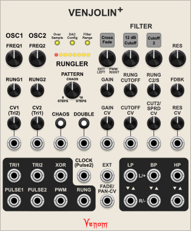  

***Important note - if you purchased the Venjolin rather than the entire Chaos Boxes plugin then your module browser will not show the Venjolin Plus. You can still access the Venjolin Plus by inserting a Venjolin into your patch, and then use the "Add Venjolin+" context menu option. You can delete the Venjolin after the Venjolin Plus has been added to your patch.***

The Venjolin Plus is an enhanced version of the Venjolin. The [Configuration](#configuration-section), [Osc1](#osc1-oscillator-1-section), [Osc2](#osc2-oscillator-2-section), and [Rungler](#rungler-section) sections are identical to the Venjolin. Refer to the [Venjolin documentation](#venjolin) for information about those sections.

The Filter section is significantly enhanced with:
- A second resonant state variable filter running in parallel with separate cutoff controls
- Option for 24db/Octave filters instead of 12db/Octave
- Each output type has left and right outputs corresponding to the 1st and 2nd filter
- Option to pan the external and PWM inputs in opposite directions instead of cross fading them
- Mono outputs can average the filter outputs or subtract one filter output from the other to get Hordijk Twin Peaks behavior like in the Vlippoo Box

The one filter feature missing from the Venjolin Plus is the Notch filter output - that is only available in the Venjolin.

The only non-filter based difference is all attenuators are bipolar attenuverters. There is no option for unipolar attenuators like in the Venjolin.

## Venjolin Plus FILTER section
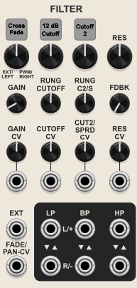  
The Venjolin Plus uses two highly resonant parallel digital state variable filters instead of just the one in the Venjolin. The cutoff ranges are the same as for the Venjolin. The same Filter Range button in the Config section sets the ranges of the cutoff knobs. The same oversample low pass filter is applied post filter, as is the DC offset blocking high pass filter when using the audio range.

### MIX square button and knob
The square button provides two options for controlling what signal(s) are used as filter input
- **Cross Fade** ***(default)*** - A single input mix is created by crossfading between the external input and the internal PWM signal. The same crossfade mix is fed to both the 1st (left) and 2nd (right) filters.
- **Cross Pan** - The external input and internal PWM signal are panned in opposite directions, with the left input going to the 1st filter, and the right going to the 2nd filter.

The knob changes behavior depending on which mode is chosen. The knob value can be modulated by the Fade/Pan CV input.

#### Cross Fade mode
The knob is scaled to show what percentage of the PWM signal is used in the mix. The external input percentage is simply 100% - the PWM percentage. Fully clockwise is 100% PWM, fully counterclockwise is 0% PWM (100% external), and the default noon position is 50% PWM (50% external).

If the external input is not patched, then the Mix knob can be used as a volume control.

#### Cross Pan mode
The knob is scaled to show how far the PWM signal is panned to the right. Fully clockwise is 100% to the right, and fully counterclockwise is 0% right (100% left). The default noon position is 50% right, meaning dead center.

The external input is panned in the opposite direction, with fully clockwise panning external input 100% to the left, fully counterclockwise 100% to the right, and the default noon position dead center.

### GAIN knob
Controls the base amount of gain applied to both filter inputs. The default is unity. The range is 0x to 10x. All filter outputs are soft clipped at +/- 10V using tanh clipping, so higher gains can be used to drive the output to saturation.

The base gain amount can be modulated by CV.

### GAIN CV input and attenuator knob
Bipolar input with a unipolar attenuator knob to modulate the filter input gain. If the context menu "Attenuator configuration" option is set to bipolar then the knob becomes a bipolar attenuverter.

The attenuated gain CV is summed with the main Gain knob value to establish the effective net input gain. The final effective gain value is clamped to a 0x to 10x range.

### EXT (External) input
This is the input for the external signal used by the Mix crossfade/crosspan control.

### MIX-CV input
Bipolar input to modulate the Mix crossfade or crosspan value. It is scaled at 10% per volt, and there is no attenuator for this input. The Mix CV is summed with the Mix knob to establish the net effective value.

The final effective Mix value is clamped to a 0% to 100% range.

### Filter Slope square button
The square filter slope setting applies to both filters. It has two values:
- **12 dB Cutoff** ***(default)*** - a 2 pole filter that falls 12 dB per octave - the slope of the standard Venjolin
- **24 db Cutoff** - a 4 pole filter that falls 24 dB per octave

### Second Cutoff Knob Mode square button
The square button controls how the second cutoff knob functions, which also impacts the first cutoff knob:
- **Spread** ***(default)*** - The 2nd cutoff knob controls the frequency spread between the two filter cutoffs
- **Cutoff 2** - The 2nd cutoff knob controls the cutoff of the second (right) filter only

### Cutoff knobs
There are two primary cutoff knobs that set the base frequencies for the two filters, prior to any modulation. The behaviors of the knobs change depending on the selected mode for the Second Cutoff knob.

#### Spread mode
The first knob (below the square slope button) sets the base frequency of both filters.

The second knob (below the square 2nd cutoff mode button) sets the amount of spread between the two filters. The value is subtracted from the first (left) filter cutoff, and added to the second (right) filter cutoff.

#### Cutoff 2 mode
The first knob (below the square slope button) sets the base frequency of the first (left) filter.

The second knob (below the square 2nd cutoff mode button) sets the base frequency of the second (right) filter. The frequency at the default noon position is intentionally slightly different than for the first filter.

### RUNG CUTOFF (Rungler cutoff) knob
Controls how much the Rungler signal modulates the value of the first cutoff knob (below the square slope button).

### RUNG C2/S (Rungler Cutoff2/Spread) knob
Controls how much the Rungler signal modulates the value of the second cutoff knob (below the square 2nd cutoff mode button).

### CUTOFF CV input and attenuator knob
Bipolar input with attenuverter knob to modulate the value of the first cutoff knob (below the square slope button).

The CV is ***not*** scaled at 1 volt per octave.

### CUT2/SPRD CV (Cutoff2/Spread CV) knob
Bipolar input with attenuverter knob to modulate the value of the second cutoff knob (below the square 2nd cutoff mode button).

The CV is ***not*** scaled at 1 volt per octave.

### RES (Resonance) knob
Controls the base amount of emphasis (amplification) applied to the cutoff frequency of both filters. The scale is arbitrary, with 0 being the minimum resonance, and 1 the maximum.

The filters will never self oscillate unless band pass feedback is applied to the inputs. But with enough feedback and resonance applied, the oscillator will self oscillate at the cutoff frequency.

### FDBK (Feedback) knob
Controls the amount of band pass output that is fed back to the filter inputs. The feedback makes the filters more resonanant. Higher feedback values can make pings ring out longer. Each filter will self oscillate at the cutoff frequency if both the resonance and feedback are near maximum.

Note that the internal feedback is not affected by the Gain.

### RES (Resonance) CV input and attenuator knob
Bipolar input with an attenuverter knob to modulate the filter resonance.

The attenuated resonance CV is summed with the base resonance knob to establish the effective resonance. The final effective resonance is clamped to the resonance knob's range.

### Filter outputs
There are three types of filter output:

#### LP (Low Pass) output
Frequencies above the cutoff are attenuated by the filter.

#### BP (Band Pass) output
Frequencies above and below the cutoff are attenuated by the filter.

#### HP (High Pass) output
Frequencies below the cutoff are attenuated by the filter.

Each output type has a vertical pair of outputs. The output for each top and bottom port changes depending on which ports are patched within the pair:

#### Both top and bottom ports patched
The top port is the first (left) filter output.  
The bottom port is the second (right) filter output.

#### Top port only patched
The top port produces the sum (average) of both filter outputs.

#### Bottom port only patched
The bottom port produces the difference between the two filter outputs (filter 1 minus filter 2). If both filters receive the same input (Cross Fade mode), then this effectively creates a single band pass output with two resonant peaks like Rob Hordijk's Twin Peaks filter.

*Quick Links: [Chaos Boxes](#venom-chaos-boxes-plugin) | [Venom Premium TOC](README.md#table-of-contents)*

# Vlippoo Box
*Quick Links: [Intro](#vlippoo-box) | [Oscillators](#oscillator-controls) | [Resonator](#resonator-controls) | [Left Ports](#left-ports-and-switch) | [Right Ports](#right-ports-and-switches) | [Menus](#context-menus-1) | [Flowchart](#vlippoo-box-flowchart) | [Chaos Boxes](#venom-chaos-boxes-plugin) | [Venom Premium TOC](README.md#table-of-contents)*

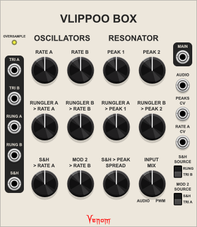  
The Vlippoo Box emulates a small analog hardware synth called the Blippoo Box that was invented by Rob Hordijk. It is a non-traditional / experimental electronic musical instrument that uses a small number of simple circuits and a minimal number of knobs to create an astonishing range of sounds and patterns. Extensive use of feedback and cross-modulation makes the Benjolin a chaotic sound source that often tends to lock into a stable short pattern and timbre after a period of time. However, it is difficult to predict exactly what the pattern and timbre will be for a given set of control positions. Performance often involves periodic movement of one or more controls to generate continued interest. 

Rob Hordkijk created at least three different versions of the Blippoo Box. The Venom Vlippoo Box replicates the feature set of the 2018 version that is now available as the Blippoo Box Legacy from BiyiBlip. It consists of the following:
- Two identical bipolar oscillators A and B, each with triangle and pulse waves. The oscillators have an extremely wide frequency range. They can operate as slow as 0.001 Hz (16.67 minutes per cycle), and as fast as 1/4 the VCV sample rate. With a typical VCV sample rate of 48 kHz, the maximum frequency is 12,000 Hz. Modulation is exponential, but not volt per octave.
- Two Runglers, each consisting of a 4 stage binary shift register and a 3 bit digital to analog converter (DAC). Rungler A is clocked by the Oscillator A pulse, with data coming from the Oscillator B pulse. Rungler B is clocked by Oscillator B, with data coming from Oscillator A. The runglers are clocked by both rising and falling edges of each clock pulse. The incoming data is not used directly, but rather is XORed with the bit that falls off the shift register. The DACs create bipolar stepped wave signals called Rungler A and Rungler B, each with 5 possible values.
- A "PWM" varying width pulse signal created by a comparator that emits 5V when Triangle A is greater than Triangle B, and -5V otherwise.
- A Sample & Hold stepped voltage signal that is clocked by the rising and falling edges of the PWM signal, with data coming from either the sum (average) of Rungler A and Rungler B, or else Triangle B.
- A cross fading mixer for the PWM signal and an external audio input. The mixer output is used as input for the Twin Peaks Resonator.
- A Twin Peaks Resonator consisting of dual 4 pole low pass resonant filters. Note that the Blippoo Box hardware actually uses a 3 pole filter. The filters are highly resonant with good ping characteristics, but do not self oscillate. The resonator subtracts the result of one filter from the other. This effectively creates a band pass output with resonant peaks at the edges of the band. This is the main ouput of the Vlippoo Box. A small portion of the output from the 2nd pole of each resonator filter is internally fed back to the resonator peak cutoffs, creating some interesting distortion and pitch modulation.

Much of the Vlippoo Box magic stems from all the modulation available for the oscillator and Twin Peak resonator cutoff frequencies. All the modulation sources are derived from the two oscillators, so it all amounts to various forms of feedback, giving rise to the chaotic nature of the instrument.

The Vlippoo Box has a different visual aesthetic than the Blippoo Box, but it shares the same physical layout. They both have 12 large control knobs in a central 3 x 4 matrix. Inputs, outputs, and switches are arranged vertically along the left and right edges of the instrument.

Modulation control knobs default to unipolar attenuators ranging from 0% to 100%. There is a context menu option to configure the knobs as bipolar attenuverters ranging from -100% to 100%.

More info about the history and architecture of the Blippoo Box hardware can be found in the [BiyiBlip Blippoo Box Legacy manual](https://drive.google.com/drive/folders/1LCwU8nwhh46Dqs3aOSZKqYqEbEpG6J0j). Example sounds from the hardware can be found in the [Blippoo Box Legacy YouTube playlist](https://www.youtube.com/watch?v=MZjyJemDhCs&list=PLn1fQIP33qhYNRvfWFAUm_XXszY1jOvvU). Information on how to obtain a physical Blippoo Box from BiyiBlip can be found in the video descriptions.

You can compare the sound of the digital Vlippoo Box vs. the analog Blippoo Box by watching two videos
- [Blippoo Box Legacy – 5 Patches That Celebrate Rob Hordijk’s Vision](https://www.youtube.com/watch?v=x1xiPDPzT9c) - From the BiyiBlip Blippoo Box Legacy playlist
- [Venom Vlippoo Box Reproducing 5 Blippoo Box Patches](https://www.youtube.com/watch?v=EkE-haL5Hk0) - I recreated the 5 Blippoo Box patches using the Vlippoo Box

Not bad for a digital emulation! You can easily distinguish the two, but the Vlippoo Box does a good job reproducing the behaviors, and I think the sound is very similar, though certainly not identical.

*Quick Links: [Intro](#vlippoo-box) | [Oscillators](#oscillator-controls) | [Resonator](#resonator-controls) | [Left Ports](#left-ports-and-switch) | [Right Ports](#right-ports-and-switches) | [Menus](#context-menus-1) | [Flowchart](#vlippoo-box-flowchart) | [Chaos Boxes](#venom-chaos-boxes-plugin) | [Venom Premium TOC](README.md#table-of-contents)*

## Oscillator controls

### RATE A knob
Sets the base frequency of Oscillator A.

### RATE B knob
Sets the base frequency of Oscillator B.

### RUNGLER A > RATE A knob
Controls the amount of Rungler A signal used to modulate the oscillator A frequency.

The knob may be unipolar or bipolar depending on the Attenuator configuration context menu option.

### RUNGLER B > RATE B knob
Controls the amount of Rungler A signal used to modulate the oscillator A frequency.

The knob may be unipolar or bipolar depending on the Attenuator configuration context menu option.

### S&H > RATE A knob
Controls the amount of Sample & Hold signal used to modulate the oscillator A frequency.

The knob may be unipolar or bipolar depending on the Attenuator configuration context menu option.

### MOD 2 > RATE B knob
Controls the amount of a second modulation source to modulate the oscillator B frequency. The lower right switch selects either the Sample & Hold or Triangle A as the modulation source.

The knob may be unipolar or bipolar depending on the Attenuator configuration context menu option.

*Quick Links: [Intro](#vlippoo-box) | [Oscillators](#oscillator-controls) | [Resonator](#resonator-controls) | [Left Ports](#left-ports-and-switch) | [Right Ports](#right-ports-and-switches) | [Menus](#context-menus-1) | [Flowchart](#vlippoo-box-flowchart) | [Chaos Boxes](#venom-chaos-boxes-plugin) | [Venom Premium TOC](README.md#table-of-contents)*

## Resonator controls

### PEAK 1 knob
Sets the base resonant frequency (cutoff) for the first filter in the resonator.

### PEAK 2 knob
Sets the base resonant frequency (cutoff) for the second filter in the resonator.

### RUNGLER A > PEAK 1 knob
Controls the amount of Rungler A signal used to modulate the frequency of Peak 1.

The knob may be unipolar or bipolar depending on the Attenuator configuration context menu option.

### RUNGLER B > PEAK 2 knob
Controls the amount of Rungler B signal used to modulate the frequency of Peak 2.

The knob may be unipolar or bipolar depending on the Attenuator configuration context menu option.

### S&H > PEAK SPREAD knob
Controls the ammount of Sample & Hold signal used to modulate the frequencies of Peak 1 and Peak 2 in opposite directions. The inverted value of the Sample & Hold is applied to Peak 1, and the original value of the Sample & Hold is applied to Peak 2.

The knob may be unipolar or bipolar depending on the Attenuator configuration context menu option.

### INPUT MIX knob
Controls what signal is used as input for the two resonator filters. It cross fades from 100% External Audio when fully counter-clockwise to 100% PWM signal when fully clockwise. The input is a 50% : 50% mix at the default noon position.

The mix knob can be used as a volume control if the Audio input remains unpatched.

*Quick Links: [Intro](#vlippoo-box) | [Oscillators](#oscillator-controls) | [Resonator](#resonator-controls) | [Left Ports](#left-ports-and-switch) | [Right Ports](#right-ports-and-switches) | [Menus](#context-menus-1) | [Flowchart](#vlippoo-box-flowchart) | [Chaos Boxes](#venom-chaos-boxes-plugin) | [Venom Premium TOC](README.md#table-of-contents)*

## Left ports and switch
The output ports on the left can be used as audio sources for the external Audio input, or as modulation sources for the Oscillator A frequency or the Resonant Peak frequencies. Or they could be used as audio or modulation for other modules in your patch. Note that the specified amplitude ranges are nominal. Anti-aliasing techniques used by the Vlippoo Box can introduce Gibbs phenomenon ringing that strays outside the specified range.

### OVERSAMPLE button
Controls the amount of band-limited oversampling used to mitigate frequency aliasing in outputs.
- **Low** ***(yellow, default)***
- **Med** ***(orange)***
- **High** ***(green)***

The values are relative. The actual degree of oversampling varies depending on the current sample rate used by VCV. The internal oversampling values are calibrated to make the outputs sound as consistent as possible regardless what sample rate is used. Higher oversample values produce less aliasing, but require more CPU power, so the minimum value that sounds good is recommended. Typically the default Low yellow setting is adequate.

This control is not present in the analog Blippoo Box hardware. It is useful for the Vlippoo Box due to the computation limitations present in all digital audio that can lead to audio frequency aliasing.

### TRI A output
The bipolar Triangle output from oscillator A that ranges from -5 to +5 volts.

### TRI B output
The bipolar Triangle output from oscillator B that ranges from -5 to +5 volts.

### RUNG A output
The bipolar Rungler A signal that ranges from -4 to +4 volts.

### RUNG B output
The bipolar Rungler B signal that ranges from -4 to +4 volts.

### S&H output
The bipolar Sample and Hold signal that ranges from -4 to +4 volts.

*Quick Links: [Intro](#vlippoo-box) | [Oscillators](#oscillator-controls) | [Resonator](#resonator-controls) | [Left Ports](#left-ports-and-switch) | [Right Ports](#right-ports-and-switches) | [Menus](#context-menus-1) | [Flowchart](#vlippoo-box-flowchart) | [Chaos Boxes](#venom-chaos-boxes-plugin) | [Venom Premium TOC](README.md#table-of-contents)*

## Right ports and switches

### MAIN output
The bipolar output from the Resonator. This is the main output for the Vlippoo Box. The amplitude of the output is highly variable, depending on how the Vlippoo Box is configured, but is guaranteed to be between -10 to +10 volts due to a saturation "circuit" that uses soft tanh clipping.

### AUDIO input
This is the external Audio source for the Input Mix cross fader.

Unlike the Blippoo Box hardware, it is possible to induce Resonator self oscillation by patching the Main ouput to the Audio input, and then adjusting the Input Mix to get the desired self oscillation behavior. Increasing Volume and/or Resonance in the context menu increases the sensitivity of the Input Mix knob toward self oscillation. The behavior is asymmetric in that only Peak 2 self oscillates and Peak 1 continues to ping. This is due to how the Main output is produced. The Peak 2 filter output is subtracted from the Peak 1 output, meaning that the resonant peaks are 180 degrees out of phase. If the Main output is inverted before patching into the Audio input, then the peaks switch places and Peak 1 self oscillates while Peak 2 pings.

### PEAKS CV input
This unattenuated CV source modulates the frequencies for both Peak 1 and Peak 2.

### RATE A CV input
This unattenuated CV source modulates the frequency of Oscillator A.

### S&H SOURCE switch
This controls the data source for the Sample & Hold. It has two values
- **RUNG** - The average of the Rungler A and Rungler B signals: (Rung A + Rung B)/2
- **TRI B** - The Triangle output from Oscillator B, scaled to a -4 to +4 volt range

### MOD 2 SOURCE
This controls what signal is used for the second modulation knob for the Oscillator B frequency. It has two options.
- **S&H** - The Sample & Hold signal
- **TRI A** - The Triangle output of Oscillator A

The Mod 2 Source switch is not present in the Blippoo Box Legacy hardware. The hardware always uses the Sample & Hold signal as the second modulation for Oscillator B. However, Blippoo Box versions from before 2018 allowed the oscillators to directly cross modulate, and makes available some of this older functionality.

*Quick Links: [Intro](#vlippoo-box) | [Oscillators](#oscillator-controls) | [Resonator](#resonator-controls) | [Left Ports](#left-ports-and-switch) | [Right Ports](#right-ports-and-switches) | [Menus](#context-menus-1) | [Flowchart](#vlippoo-box-flowchart) | [Chaos Boxes](#venom-chaos-boxes-plugin) | [Venom Premium TOC](README.md#table-of-contents)*

## Context menus

### Add Vlippoo Box+
You can use this menu option to add a [Vlippoo Box Plus module](#vlippoo-box-plus) to your patch. If you purchased the Vlippoo Box then this is the only way to access the Vlippoo Box Plus. If you purchased the entire Chaos Boxes plugin then you can access the Vlippoo Box Plus through your module browser, and there is no need to use this option.

### Attenuator configuration
Controls the behavior of the Rungler and CV modulation knobs
- **Unipolar** ***(default)*** - Attenuates the modulation signal to between 0% and 100%
- **Bipolar** - Attenuates and/or inverts the modulation signal to between -100% and 100%

### Volume
Controls the gain level at the Resonator input
- **Soft** ***(default)*** - Produces a relatively quiet output that is most like the hardware, but may not be optimal for integration with larger patches
- **Med** - Produces an intermediate output level
- **Full** - Produces the highest output level that is more likely to result in output saturation

### Resonance
Controls the resonance of the Resonator filters
- **Soft** ***(default)*** - Limited amount of resonant ringing that is most like the hardware
- **Med** - An intermediate level of resonant ringing
- **Full** - The highest level of resonant ringing that is more likely to result in output saturation

### Expander options
There are four options to add [Chaos Gates](#chaos-gates-expander) and/or [Chaos Volts](#chaos-volts-expander) expanders to the left or right of the Vlippoo Box. The expanders give access to the underlying Rungler shift register bits. Expanders to the left use the Rungler A clock, and expanders to the right use the Rungler B clock. In either position the first four bits are from Rungler A and the second four are from Rungler B.

### Standard context menu options
Venom Themes, Custom Names, and Parameter Locks and Custom Defaults are available via [standard Venom context menu options](README.md#standard-venom-context-menus) that are common to all Venom modules.

*Quick Links: [Intro](#vlippoo-box) | [Oscillators](#oscillator-controls) | [Resonator](#resonator-controls) | [Left Ports](#left-ports-and-switch) | [Right Ports](#right-ports-and-switches) | [Menus](#context-menus-1) | [Flowchart](#vlippoo-box-flowchart) | [Chaos Boxes](#venom-chaos-boxes-plugin) | [Venom Premium TOC](README.md#table-of-contents)*

## Vlippoo Box Flowchart
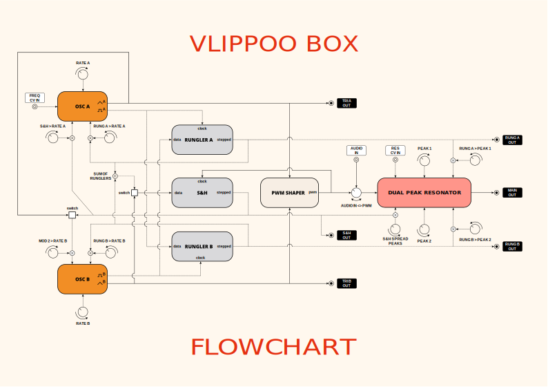

*Quick Links: [Intro](#vlippoo-box) | [Oscillators](#oscillator-controls) | [Resonator](#resonator-controls) | [Left Ports](#left-ports-and-switch) | [Right Ports](#right-ports-and-switches) | [Menus](#context-menus-1) | [Flowchart](#vlippoo-box-flowchart) | [Chaos Boxes](#venom-chaos-boxes-plugin) | [Venom Premium TOC](README.md#table-of-contents)*

# Vlippoo Box Plus
*Quick Links: [Intro](#vlippoo-box-plus) | [Oscillators](#oscillator-section) | [Modulators](#modulator-section) | [Mixer](#mixer-section) | [Filter](#filter-section-1) | [Chaos Boxes](#venom-chaos-boxes-plugin) | [Venom Premium TOC](README.md#table-of-contents)*

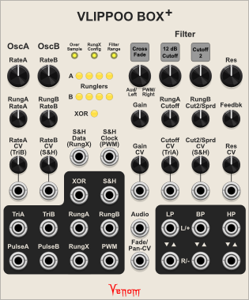  

***Important note - if you purchased the Vlippoo Box rather than the entire Chaos Boxes plugin then your module browser will not show the Vlippoo Box Plus. You can still access the Vlippoo Box Plus by inserting a Vlippoo Box into your patch, and then use the "Add Vlippoo Box+" context menu option. You can delete the Vlippoo Box after the Vlippoo Box Plus has been added to your patch.***

The Vlipoo Box Plus is an enhanced version of a Vlippoo Box. Although it looks completely different, it has all of the same components as the basic Vlippoo Box. Refer to the [Vlippoo Box introduction](https://github.com/DaveBenham/VenomPremiumDev/blob/main/VenomChaosBoxes.md#vlippoo-box) for the basic design.

The Plus version enhances the Vlippoo Box in four general ways:

### More inputs, outputs, and modulation options

The Vlippoo Box has a minimal set of inputs and outputs, and the modulations are hardwired internally, without many options.

The Plus version exposes all the internal signals as outputs, and provides numerous inputs to override the internal choices for modulation.

All modulation attenuators are bipolar attenuverters in the Plus version.

### Additional modulation signals

#### RunglerX
The Vlippoo Box uses the average of the Rungler A and Rungler B signals as the input to the Sample & Hold with 9 possible values. The Plus version exposes this signal and calls it RunglerX, but also provides an option to construct the RunglerX in a different way that is less correlated with the Rungler A and B signals. The alternate RunglerX uses two bits from the Rungler A shift register, and two bits from the Rungler B shift register to create a bipolar stepped wave with 16 possible values.

#### XOR
A brand new signal called XOR is created by XORing the first bit from Rungler A with the first bit from Rungler B.

### Greatly enhanced dual filter

The dual peaks resonator in the Vlippoo Box has a wonderful sound, but with a somewhat limited range. The Plus version greatly enhances the filter
- Multimode outputs, including Low Pass, High Pass, and Band Pass
- Direct control over resonance
- Addition of built in feedback control for increased resonance, to the point of self oscillation being possible
- Direct control of input gain for wider volume range with the possibility for greater saturation
- Options for stereo inputs and outputs
- Mono outputs can subtract one filter from the other for Twin Peaks sounds, or average the filter outputs 
- Options for 12 dB/Octave and 24 dB/Octave slopes (2 pole or 4 pole)

The added flexability comes with a minor cost. The Vlippoo Box lets you modulate the second peak frequency independent from the first, and also lets you modulate the spread between the two peaks. The plus version lets you control one or the other, but not both at the same time.

### Modified context menu options
The Vlippoo Box Plus filter gives you full control over the gain and resonance, so there is no need for Volume or Resonance context menu options.

Because all modulation amount knobs are bipolar attenuverters, there is no attenuator configuration context menu option.

The Vlippoo Box Plus filter has low pass output capabilities, which can yield high DC offsets in the output. So a context menu option has been added to apply a high pass filter to filter outputs when in Audio mode.

The expander context menu options and standard menu options remain the same as for the Vlippoo Box.

*Quick Links: [Intro](#vlippoo-box-plus) | [Oscillators](#oscillator-section) | [Modulators](#modulator-section) | [Mixer](#mixer-section) | [Filter](#filter-section-1) | [Chaos Boxes](#venom-chaos-boxes-plugin) | [Venom Premium TOC](README.md#table-of-contents)*

## Oscillator section
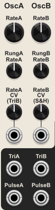  

The oscillators have the same frequency range as the base Vlippoo Box.

### RateA knob
Sets the base frequency for oscillator A.

### RateB knob
Sets the base frequency for oscillator B.

### RungA RateA knob
Controls how much Rungler A should modulate oscillator A frequency.

### RungB RateB knob
Controls how much Rungler B should modulate oscillator B frequency.

### RateA CV input and knob
Lets you patch in any signal to modulate oscillator A frequency. The knob attenuates and/or inverts the modulation.

The input is normalled to the oscillator B triangle output.

The CV is ***not*** scaled at 1 volt per octave.

### RateB CV input and knob
Lets you patch in any signal to modulate oscillator B frequency. The knob attenuates and/or inverts the modulation.

The input is normalled to the Sample & Hold output.

The CV is ***not*** scaled at 1 volt per octave.

### TriA output
The +-5 V bipolar triangle output for oscillator A

### TriB output
The +/-5 V bipolar triangle output for oscillator B

### PulseA output
The +/-5 V bipolar pulse output for oscillator A

### PulseB output
The +/-5 V bipolar pulse output for oscillator B

*Quick Links: [Intro](#vlippoo-box-plus) | [Oscillators](#oscillator-section) | [Modulators](#modulator-section) | [Mixer](#mixer-section) | [Filter](#filter-section-1) | [Chaos Boxes](#venom-chaos-boxes-plugin) | [Venom Premium TOC](README.md#table-of-contents)*

## Modulator section
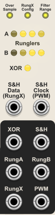  
Controls, inputs, and outputs related to modulation signals that may be used externally or for feedback patching.

The top of this section includes some buttons that aren't really related to modulation.

### Over Sample button
Controls the amount of band-limited oversampling used to mitigate frequency aliasing in outputs.
- **Low** ***(yellow, default)***
- **Med** ***(orange)***
- **High** ***(green)***

The values are relative. The actual degree of oversampling varies depending on the current sample rate used by VCV. The internal oversampling values are calibrated to make the outputs sound as consistent as possible regardless what sample rate is used. Higher oversample values produce less aliasing, but require more CPU power, so the minimum value that sounds good is recommended. Typically the default Low yellow setting is adequate.

### RungX Config button
Controls which method is used to create the +/- 4V RunglerX stepped wave.
- **Runglers A + B** ***(yellow, default)*** - The Rungler A and Rungler B outputs are summed and then divided by 2 to give the average with 9 possible values.
- **Rungler bits [A4,B2,B4,A2]** ***(blue)*** - A DAC converts two bits from Rungler A and two bits from Rungler B into a +/-4 V stepped wave signal with 16 possible values.

### Filter Range button
Controls the range of the filter cutoff knobs in the Filter section. Note that this does not alter the range that can be achieved via modulation.
- **Audio** ***(yellow, default)*** - 4 Hz - 16 kHz with default noon value of 250 Hz. This is most like the Benjolin hardware
- **Audio & LFO** ***(orange)*** - 0.06 Hz - 15.4 kHz with default noon value of 30 Hz.
- **LFO** ***(red)*** - 0.06 Hz - 64 Hz with default noon value of 2 Hz.

The second and third option may be useful when using the Vlippoo Box Plus to create LFO rate CV signals.

### Runglers A and B LED lights
The state of each Rungler shift register is shown by 4 LED lights. The left most LED indicates the first bit and it glows dull yellow when high. Bits 2, 3, and 4 are fed to the DAC and glow bright yellow when high.

### XOR LED light
Shows the state of the XOR signal, glowing bright yellow when the signal is high.

### S&H Data input
Lets you patch in any signal to use as data for the Sample and Hold.

The input is normalled to the RungX output.

### S&H Clock input
Lets you patch in any signal to trigger the Sample and Hold.

The input is normalled to the PWM output.

The Sample and Hold uses a Schmitt trigger that goes high at 2 V and low at 0.2 V.

### XOR output
The +/-5 V bipolar pulse signal is the result of the XOR operation on the 1st bit of the two Rungler shift registers

### S&H output
The output of the sample and hold

### RungA output
The +/-4 V bipolar stepped wave output from Rungler A with 5 possible values

### RungB output
The +/-4 V bipolar stepped wave output from Rungler B with 5 possible values

### RungX output
RunglerX is the default +/-4V bipolar stepped wave signal used as data for the sample and hold.

It has either 16 or 9 possible values, depending on the setting of the RungX Config button.

### PWM output
The +/-5 V bipolar PWM signal consisting of a voltage spike for every time the oscillator A triangle crosses the oscillator B triangle.

*Quick Links: [Intro](#vlippoo-box-plus) | [Oscillators](#oscillator-section) | [Modulators](#modulator-section) | [Mixer](#mixer-section) | [Filter](#filter-section-1) | [Chaos Boxes](#venom-chaos-boxes-plugin) | [Venom Premium TOC](README.md#table-of-contents)*

## Mixer section
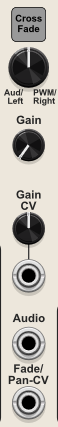  
The mixer determines what signals are are used as input to the Filter. The PWM signal is hard wired as one of the possible signals, and an input port allows you to patch in another signal.

### Mix square button and knob
The square button provides two options for controlling what signal(s) are used as filter input
- **Cross Fade** ***(default)*** - A single input mix is created by crossfading between the Audio external input and the internal PWM signal. The same crossfade mix is fed to both the first (left) and second (right) filters.
- **Cross Pan** - The external Audio input and internal PWM signal are panned in opposite directions, with the left input going to the first filter, and the right going to the second filter.

The knob changes behavior depending on which mode is chosen. The knob value can be modulated by the Fade/Pan CV input.

#### Cross Fade mode
The knob is scaled to show what percentage of the PWM signal is used in the mix. The external input percentage is simply 100% - the PWM percentage. Fully clockwise is 100% PWM, fully counterclockwise is 0% PWM (100% external), and the default noon position is 50% PWM (50% external).

If the external input is not patched, then the Mix knob can be used as a volume control.

#### Cross Pan mode
The knob is scaled to show how far the PWM signal is panned to the right. Fully clockwise is 100% to the right, and fully counterclockwise is 0% right (100% left). The default noon position is 50% right, meaning dead center.

The external input is panned in the opposite direction, with fully clockwise panning external input 100% to the left, fully counterclockwise 100% to the right, and the default noon position dead center.

### Gain knob
Controls the base amount of gain applied to both filter inputs. The default is unity. The range is 0x to 10x. All filter outputs are soft clipped at +/- 10V using tanh clipping, so higher gains can be used to drive the output to saturation.

The base gain amount can be modulated by CV.

### Gain CV input and attenuator knob
Bipolar input with a bipolar attenuator knob to modulate the filter input gain.

The attenuated gain CV is summed with the main Gain knob value to establish the effective net input gain. The final effective gain value is clamped to a 0x to 10x range.

### Audio input
This is the input for the external Audio signal used by the Mix crossfade/crosspan control.

### Fade/Pan-CV input
Bipolar input to modulate the Mix crossfade or crosspan value. It is scaled at 10% per volt, and there is no attenuator for this input. The CV is summed with the Mix knob to establish the net effective value.

The final effective Mix value is clamped to a 0% to 100% range.

*Quick Links: [Intro](#vlippoo-box-plus) | [Oscillators](#oscillator-section) | [Modulators](#modulator-section) | [Mixer](#mixer-section) | [Filter](#filter-section-1) | [Chaos Boxes](#venom-chaos-boxes-plugin) | [Venom Premium TOC](README.md#table-of-contents)*

## Filter section
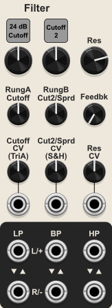  

### Filter Slope square button
The square filter slope setting applies to both filters. It has two values:
- **12 dB Cutoff** - a 2 pole filter that falls 12 dB per octave
- **24 db Cutoff** ***(default)*** - a 4 pole filter that falls 24 dB per octave - the slope of the standard Vlippoo Box

### Second Cutoff Knob Mode square button
The square button controls how the second cutoff knob functions, which also impacts the first cutoff knob:
- **Cutoff 2** ***(default)*** - The 2nd cutoff knob controls the cutoff of the second (right) filter only
- **Spread** - The 2nd cutoff knob controls the frequency spread between the two filter cutoffs

### Cutoff knobs
There are two primary cutoff knobs that set the base frequencies for the two filters, prior to any modulation. The behaviors of the knobs change depending on the selected mode for the Second Cutoff knob.

#### Spread mode
The first knob (below the square slope button) sets the base frequency of both filters.

The second knob (below the square 2nd cutoff mode button) sets the amount of spread between the two filters. The value is subtracted from the first (left) filter cutoff, and added to the second (right) filter cutoff.

#### Cutoff 2 mode
The first knob (below the square slope button) sets the base frequency of the first (left) filter.

The second knob (below the square 2nd cutoff mode button) sets the base frequency of the second (right) filter. The frequency at the default noon position is intentionally slightly different than for the first filter.

### RungA Cutoff knob
Controls how much the Rungler A signal modulates the value of the first cutoff knob (below the square slope button).

### RungB Cut2/Sprd (Rungler B Cutoff 2 or Spread) knob
Controls how much the Rungler signal modulates the value of the second cutoff knob (below the square 2nd cutoff mode button).

### Cutoff CV input and attenuator knob
Bipolar input with attenuverter knob to modulate the value of the first cutoff knob (below the square slope button).

The input is normalled to the oscillator A triangle output.

The CV is ***not*** scaled at 1 volt per octave.

### Cut2/Sprd CV (Cutoff2/Spread CV) knob
Bipolar input with attenuverter knob to modulate the value of the second cutoff knob (below the square 2nd cutoff mode button).

The input is normalled to the Sample & Hold output.

The CV is ***not*** scaled at 1 volt per octave.

### Res (Resonance) knob
Controls the base amount of emphasis (amplification) applied to the cutoff frequency of both filters. The scale is arbitrary, with 0 being the minimum resonance, and 1 the maximum.

The filters will never self oscillate unless band pass feedback is applied to the inputs. But with enough feedback and resonance applied, the oscillator will self oscillate at the cutoff frequency.

### Feedbk (Feedback) knob
Controls the amount of band pass output that is fed back to the filter inputs. The feedback makes the filters more resonanant. Higher feedback values can make pings ring out longer. Each filter will self oscillate at the cutoff frequency if both the resonance and feedback are near maximum.

Note that the internal feedback is not affected by the Gain.

### Res (Resonance) CV input and attenuator knob
Bipolar input with an attenuverter knob to modulate the filter resonance.

The attenuated resonance CV is summed with the base resonance knob to establish the effective resonance. The final effective resonance is clamped to the resonance knob's range.

### Filter outputs
There are three types of filter output:

#### LP (Low Pass) output
Frequencies above the cutoff are attenuated by the filter.

#### BP (Band Pass) output
Frequencies above and below the cutoff are attenuated by the filter.

#### HP (High Pass) output
Frequencies below the cutoff are attenuated by the filter.

Each output type has a vertical pair of outputs. The output for each top and bottom port changes depending on which ports are patched within the pair:

#### Both top and bottom ports patched - stereo output
The top port is the first (left) filter output.  
The bottom port is the second (right) filter output.

#### Top port only patched - standard mono output
The top port produces the sum (average) of both filter outputs.

#### Bottom port only patched - normal Vlippoo Box mono output
The bottom port produces the difference between the two filter outputs (filter 1 minus filter 2). If both filters receive the same input (Cross Fade mode), then this effectively creates a single band pass output with two flanking resonant peaks like Rob Hordijk's Twin Peaks filter.

*Quick Links: [Intro](#vlippoo-box-plus) | [Oscillators](#oscillator-section) | [Modulators](#modulator-section) | [Mixer](#mixer-section) | [Filter](#filter-section-1) | [Chaos Boxes](#venom-chaos-boxes-plugin) | [Venom Premium TOC](README.md#table-of-contents)*

# Chaos Gates Expander
  
Adds additional gate outputs derived from one or more underlying digital shift registers within the parent base module.

Any number of expanders may be used. All expanders must be placed to the right or left of the base module in a contiguous chain, without any gaps. An upper left or right LED glows yellow when the expander is successfully connected to a base module, and glows red if not connected.

Note the gate outputs do not participate in oversampling.

The timing of updates to the gate outputs can be driven by a clock.

The definitions of the underlying shift register bits and driving clock vary depending on the base module, and the location of the expander relative to the base.
|Base Module|Right Parent Bits (Left Expander)|Right Parent Clock (Left Expander)|Left Parent Bits (Right Expander)|Left Parent Clock (Right Expander)|
|---|---|---|---|---|
|[Venjolin](#venjolin) [Venjolin+](#venjolin-plus)|All 8 Rungler bits|The Rungler clock|All 8 Rungler bits|The Rungler clock|
|[Vlippoo Box](#vlippoo-box) [Vlippoo Box+](#vlippoo-box-plus)|Rungler A 4 bits followed by Rungler B 4 bits|Rungler A clock|Rungler A 4 bits followed by Rungler B 4 bits|Rungler B clock|
|[Hybrid Knot](#hybrid-knot)|All 8 Shift Register 1 bits|Shift Register 1 clock|All 8 Shift Register 2 bits|Shift Register 2 clock|

### DIR (Parent Direction) button
Controls whether the expander looks for a parent to the left or right
- **Left** (Yellow, default)
- **Right** (Orange)

### MODE (Gate Mode) button
This color coded button controls the timing and length of the gate outputs:
- **Gate** (white, default) - The gate is high as long as the gate logic is true
- **Clock gate** (yellow) - The gate is high when the gate logic is true and the driving clock is high
- **Inverse clock gate** (orange) - The gate is high when the gate logic is true and the driving clock is low
- **Trigger** (green) - A trigger is sent when the gate logic transitions to true
- **Clock rise trigger** (light blue) - A trigger is sent when the driving clock transitions to high while the gate logic is true
- **Clock fall trigger** (dark blue) - A trigger is sent when the driving clock transitions to low while the gate logic is true
- **Clock edge trigger** (purple) - A trigger is sent when the driving clock tranitions to high or low while the gate logic is true

Triggers are high for 1 msec. But if using a clocked trigger and the clock goes low before the trigger has completed, then the trigger immediately goes low.

### POLAR (Polarity) button
This color coded button controls the polarity of the gate outputs
- **Unipolar** (green, default) - Low = 0V and high = 10V
- **Bipolar** (purple) - Low = -5 V and high = 5 V

### 8 Gate outputs
The LED in the upper right corner of each output port glows yellow whenever the output gate is high.

Each output port has a context menu to specify which shift register bits are used, and what logic operator to use. By default the gate logic is used for the port name, and displayed as a label above the port.

#### Gate bits
You may select up to 4 bits. Once 4 have been selected you cannot select another without first unselecting one.

#### Gate logic
You must select one of three options:
- **AND** (&) - The gate logic is true if all selected bits are high
- **OR** (|) - The gate logic is true if at least one selected bit is high
- **XOR** (^) - The gate logic is true if exactly one selected bit is high

If only one bit is selected, then all logic operations give the same result - the logic is true if the selected bit is high.

*Quick Links: [Chaos Boxes](#venom-chaos-boxes-plugin) | [Venom Premium TOC](README.md#table-of-contents)*

# Chaos Volts Expander
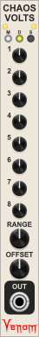  
Adds an additional stepped control voltage output derived from one or more underlying digital shift registers within the parent base module. It works as a configurable digital to analog converter.

Any number of expanders may be used. All expanders must be placed to the right or left of the base module in a contiguous chain, without any gaps. An upper left or right LED glows yellow when the expander is successfully connected to a base module, and glows red if not connected.

Note the CV output does not participate in oversampling.

The timing of updates to the CV output can be driven by a clock.

The definitions of the underlying shift register bits and driving clock vary depending on the base module, and the location of the expander relative to the base.
|Base Module|Right Parent Bits (Left Expander)|Right Parent Clock (Left Expander)|Left Parent Bits (Right Expander)|Left Parent Clock (Right Expander)|
|---|---|---|---|---|
|[Venjolin](#venjolin) [Venjolin+](#venjolin-plus)|All 8 Rungler bits|The Rungler clock|All 8 Rungler bits|The Rungler clock|
|[Vlippoo Box](#vlippoo-box) [Vlippoo Box+](#vlippoo-box-plus)|Rungler A 4 bits followed by Rungler B 4 bits|Rungler A clock|Rungler A 4 bits followed by Rungler B 4 bits|Rungler B clock|
|[Hybrid Knot](#hybrid-knot)|All 8 Shift Register 1 bits|Shift Register 1 clock|All 8 Shift Register 2 bits|Shift Register 2 clock|

### M (update timing Mode) button
- **Continuous** (white, default) - The outut is updated whenever the underlying shift register state changes
- **Clock rising edge** (light blue) - The output is updated on the rising edge of a driving clock gate
- **Clock falling edge** (dark blue) - The output is updated on the falling edge of a driving clock gate

### D (parent Direction) button
Controls whether the expander looks for a parent to the left or right
- **Left** (Yellow, default)
- **Right** (Orange)

### S (Snap) button
If on (white), then the Bit knobs snap to powers of 2. If off (gray) then the knobs can be freely set to any decimal value betwen 0 and 128.

### Bit knobs 1-8
Each knob assigns a value between 0 and 128 to a specific shift register bit. Knobs (bits) set to 0 do not participate in the digital to analog conversion. The assigned values for all high shift register bits are summed, and then scaled and offset to a bipolar +/- 5V range (10 VPP).

### RANGE knob
Scales the peak to peak range of the output to any value between 0 and 10V.

### OFFSET knob
Offsets the output by any value between -10V and 10V. The Offset is applied after the Range.

### OUT port
The final computed control voltage is ouput here.

*Quick Links: [Chaos Boxes](#venom-chaos-boxes-plugin) | [Venom Premium TOC](README.md#table-of-contents)*
